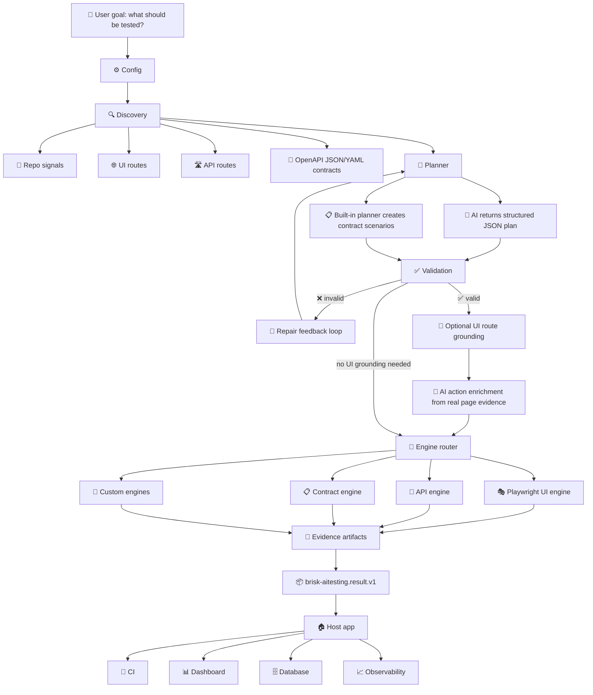

<div align="center">
  
  <h1>brisk-aitesting</h1>
  <p><strong>Fast, No-nonsense and Effective</strong></p>

  <!-- Badges -->
  <p>
    
    
    
    
    
  </p>
</div>

<br />

<!-- Hero -->
<div align="center">
  <h2>A locally embeddable software testing layer, powered by AI planning and precise engineering.</h2>
  <p>
    Embed it inside your product, run it from the CLI, or wire it into CI.
    Tell it what to test in human language. Brisk discovers the app, plans the checks, runs the right engines, and returns clean evidence.
    No hosted meter. No forced dashboard. Your software owns the workflow and the result.
  </p>
</div>

<br />

`brisk-aitesting` helps teams turn a human testing goal into real, runnable checks for SaaS products, APIs, UI flows, OpenAPI contracts, and custom systems.

It is built for two audiences at once:

| Audience | Why they should care |
|:---------|:---------------------|
| Business leaders | Software is being created faster than manual verification can keep up. Testing is expensive, fragmented, and full of repeated work. |
| Developers | Use a local SDK and CLI that can inspect your app, produce a safe test plan, run browser/API/contract checks, and hand back one result object. |

<!-- The Promise Card -->
<table>
  <tr>
    <td align="center">
      <h3>The Promise</h3>
      <blockquote>
        <em>Say what should be tested.<br />
        Brisk discovers what exists.<br />
        It chooses the right test path.<br />
        It creates a checked plan.<br />
        It runs the right engines.<br />
        It returns evidence your product can use.</em>
      </blockquote>
      <br />
      <sub>This is <strong>not</strong> just a Playwright wrapper. Playwright is one built-in engine. API checks, OpenAPI contract checks, schema validation, route discovery, AI planning, validation, repair, evidence capture, and result handover are also part of the product.</sub>
    </td>
  </tr>
</table>

## Why This Exists

Software testing is now a **global problem**.

AI is accelerating how fast software gets created. Industry leaders are clear:

<br />

<!-- Executive Quotes -->
<table>
  <tr>
    <td width="33%" align="center">
      <blockquote>AI could write <strong>90% of code</strong> in a short time window and eventually nearly all code.</blockquote>
      <sub>— <strong>Dario Amodei</strong>, Anthropic CEO<br />
      <a href="https://www.cfr.org/event/ceo-speaker-series-dario-amodei-anthropic">Council on Foreign Relations</a></sub>
    </td>
    <td width="33%" align="center">
      <blockquote>More than a <strong>quarter of new Google code</strong> was already AI-generated and then reviewed by engineers.</blockquote>
      <sub>— <strong>Sundar Pichai</strong>, Google CEO<br />
      <a href="https://www.theverge.com/2024/10/29/24282757/google-new-code-generated-ai-q3-2024">The Verge</a></sub>
    </td>
    <td width="33%" align="center">
      <blockquote>A <strong>very large share</strong> of code will be AI-generated within five years.</blockquote>
      <sub>— <strong>Kevin Scott</strong>, Microsoft CTO<br />
      <a href="https://www.businessinsider.com/microsoft-cto-ai-generated-code-software-developer-job-change-2025-4">Business Insider</a></sub>
    </td>
  </tr>
</table>

<br />

Yet testing remains **expensive and fragmented**.

<!-- Market Stats -->
<table>
  <tr>
    <td align="center" bgcolor="f0f8ff">
      <h3>💰 $54.44B</h3>
      <sub>Software testing market (2026)</sub>
    </td>
    <td align="center" bgcolor="f0f8ff">
      <h3>📈 $99.94B</h3>
      <sub>Projected by 2031</sub>
    </td>
    <td align="center" bgcolor="fff0f0">
      <h3>💰 $24.25B</h3>
      <sub>Automation testing market (2026)</sub>
    </td>
    <td align="center" bgcolor="fff0f0">
      <h3>📈 $84.22B</h3>
      <sub>Projected by 2034</sub>
    </td>
  </tr>
  <tr>
    <td colspan="4" align="center">
      <sub>
        <a href="https://www.mordorintelligence.com/industry-reports/software-testing-market">Mordor Intelligence</a>
        &nbsp;·&nbsp;
        <a href="https://www.fortunebusinessinsights.com/automation-testing-market-107180">Fortune Business Insights</a>
      </sub>
    </td>
  </tr>
</table>

<br />

> **The world is producing software faster, but verification is still slow, manual, tool-heavy, and expensive.**

<br />

### The Old Workflow

| Step | Who | Pain |
|:----:|:---:|:----:|
| 1 | Product teams | Explain what should be tested |
| 2 | Testers | Translate into manual UAT steps |
| 3 | Automation engineers | Write Playwright, API, contract, or custom scripts |
| 4 | Multiple tools | Produce different reports |
| 5 | Developers | Spend time finding what failed and why |
| 6 | Everyone | Rebuild the same testing pipeline again |

### The brisk-aitesting Solution

| Step | What happens |
|:----:|:------------|
| 1 | Say the goal in **human language** |
| 2 | Let **discovery** inspect the app, repo, routes, and contracts |
| 3 | Let **AI** create a structured JSON plan, not unsafe code |
| 4 | **Validate and repair** the plan before execution |
| 5 | **Ground** UI actions against real page evidence |
| 6 | **Execute** with the right engines |
| 7 | Return **one stable handover object** for CI, dashboards, databases, or internal platforms |

## Competitive Position

The AI testing market is already real. Products like mabl, Katalon, Tricentis Tosca, testRigor, and Functionize prove that serious companies spend heavily to reduce manual testing, flaky automation, and slow release cycles.

Brisk is designed differently: local, embeddable, evidence-first, and built around a strict AI safety boundary.

| Positioning point | Why Brisk is different |
|:------------------|:-----------------------|
| Local by default | Use it inside your own product, CLI, or CI without forcing a hosted dashboard |
| AI with control | AI proposes structured plans; Brisk validates before execution |
| Multi-engine core | UI, API, OpenAPI contracts, schema fuzzing, replay, Playwright, and Schemathesis can share one pipeline |
| Evidence handover | Results come back as versioned JSON your product can store, render, or send to CI |
| Extensible by design | Custom engines and adapters fit the same result contract |

See the sourced enterprise comparison: [Competitive Comparison](./docs/COMPETITIVE_COMPARISON.md).

## How It Works

`brisk-aitesting` is not "AI writes random Playwright code and runs it."

It is a controlled testing pipeline:

| Step | What happens |
|:----:|:-------------|
| 1 | It looks at your repo, routes, UI pages, and OpenAPI files. |
| 2 | It asks AI to create a structured test plan in JSON. |
| 3 | It checks and repairs that plan before anything is allowed to run. |
| 4 | It sends each test to the right built-in engine: browser, API, OpenAPI contract, schema fuzz, or replay. |
| 5 | It collects screenshots, traces, request/response data, logs, and final results. |
| 6 | It gives your app one stable JSON result that you can store, show, or send to CI. |

The most important idea is simple:

```text
AI suggests the plan.
Brisk checks the plan.
Engines run the tests.
Evidence shows what actually happened.
```

## Product Status

This section keeps the promise honest: what is built, what is partly built, and what is still expansion work.

| Area | Status today | What users get |
|:-----|:-------------|:---------------|
| UI testing | Built | Browser tests through Playwright with grounded page evidence. |
| API testing | Built | HTTP checks, status checks, body checks, headers, and schema-backed response checks. |
| OpenAPI testing | Built | JSON/YAML contract parsing, route discovery, positive and negative API scenarios, response schema validation. |
| Built-in schema fuzzing | Built | Fast malformed-request checks from OpenAPI request schemas, with evidence in the same result contract. |
| Contract drift report | Built | Compares OpenAPI operations with repo/runtime API routes discovered from supported JavaScript/TypeScript patterns and reports matched, undocumented, and missing routes. |
| AI planning | Built | AI returns JSON plans. Plans pass the public AJV-backed contract gate, then Brisk validates and repairs them before execution. |
| Result handover | Built | One versioned JSON result for CI, dashboards, databases, and internal tools. |
| Local SDK/CLI | Built | Use it inside your app or from the command line. No hosted platform required. |
| Schemathesis OpenAPI deep API checker | Built | Optional Python/Schemathesis engine that sends many real OpenAPI request variations. |
| Replay engine | Built | Reruns declared HTTP interactions to catch regressions quickly, with evidence in the same result contract. |
| Message/event testing | Expansion work | AsyncAPI/Pact/message-contract adapters are not built into the package yet. |
| Specmatic adapter | Expansion work | Planned as an optional adapter for teams that want Specmatic-backed contract execution. |
| Keploy compatibility | Expansion work | Built-in replay exists today; Keploy import/export compatibility is not built yet. |
| UI healing | Expansion work | Planned: if a button or field moves, retry with fresh page evidence and show exactly what changed. |
| Serious SaaS proof app | Built | A real sample product used to prove auth, roles, UI, API, OpenAPI, negative cases, state changes, and saved evidence. |
| Full proof app collection | Expansion work | Serious SaaS exists today; Todo, e-commerce, API-only, multi-tenant, and event/messaging proof apps are still pending. |
| Built-in engine quality check | Built | Built-in engines must prove they can run, return the expected result shape, and save evidence. |
| External engine quality check | Built for engines | Third-party engines must prove routing, result shape, artifact shape, timeout handling, and secret safety before being trusted. |
| Non-engine extension checks | Expansion work | Engine checks exist today; quality checks for custom discovery, planning, validation, UI grounding, and AI provider extensions are still pending. |

### What Is Ready Now

These are not future promises anymore:

| Ready now | Why it matters |
|:----------|:---------------|
| Serious SaaS proof app | We test against a real product shape, not only tiny examples. |
| Golden expected outputs | We keep known-good plans and results so future changes cannot quietly weaken behavior. |
| Public plan contract gate | Every plan must pass the exported `brisk-aitesting.plan.v1` JSON Schema before Brisk-specific execution checks run. |
| External engine quality check | A custom engine must prove it behaves safely before teams trust it. |
| Schemathesis OpenAPI deep API checker | Brisk can run a real third-party OpenAPI testing tool and fold the results into the same evidence format. |
| Built-in schema fuzzing | Brisk can run fast malformed-request checks from OpenAPI request schemas without Python. |
| Built-in replay engine | Brisk can rerun declared HTTP interactions and show exactly what changed. |
| Adapter readiness gate | If we call an adapter "built", automation checks code, docs, packaging, CI wiring, proof app coverage, and result evidence. |

### Still To Build

These are the real remaining product areas, listed separately so nobody confuses them with completed work:

| Still to build | User impact |
|:----------------|:------------|
| More proof apps | More confidence across common product shapes like e-commerce, API-only, and event-driven systems. |
| Message adapters | Coverage beyond browser screens and HTTP APIs. |
| UI healing | Fewer fragile browser failures, with a clear before/after explanation. |
| Non-engine extension checks | Safer custom discovery, planning, validation, UI grounding, and AI provider extensions. |

## What It Solves

`brisk-aitesting` helps teams avoid the biggest testing bottlenecks:

<!-- Bottleneck Cards -->
<table>
  <tr>
    <td>❌ <strong>No need</strong> to hand-code every test from scratch</td>
    <td>❌ <strong>No need</strong> to force every scenario into only browser automation</td>
  </tr>
  <tr>
    <td>❌ <strong>No need</strong> to trust raw AI-generated TypeScript</td>
    <td>❌ <strong>No need</strong> to build a database or dashboard into the engine</td>
  </tr>
  <tr>
    <td>❌ <strong>No need</strong> to throw away existing host-app configuration</td>
    <td>❌ <strong>No need</strong> to guess selectors from AI output</td>
  </tr>
</table>

<br />

### Designed For

<table>
  <tr>
    <td align="center">🏢</td>
    <td><strong>SaaS platforms</strong></td>
    <td align="center">🏭</td>
    <td><strong>Internal enterprise apps</strong></td>
  </tr>
  <tr>
    <td align="center">💻</td>
    <td><strong>Local developer repos</strong></td>
    <td align="center">🔌</td>
    <td><strong>API-first products</strong></td>
  </tr>
  <tr>
    <td align="center">📋</td>
    <td><strong>OpenAPI-backed services</strong></td>
    <td align="center">🌐</td>
    <td><strong>Browser workflows</strong></td>
  </tr>
  <tr>
    <td align="center">🔄</td>
    <td><strong>CI pipelines</strong></td>
    <td align="center">⚙️</td>
    <td><strong>Custom test engines</strong></td>
  </tr>
</table>

## 🚀 What It Can Do

`brisk-aitesting` is designed to be the **embedded testing layer** that a product team can plug into its own SaaS, repo, CI, or internal platform.

<br />

<div align="center">
  <blockquote><em>It does not only click screens.<br />It understands app surfaces, plans tests, chooses engines, runs checks, and returns evidence.</em></blockquote>
</div>

<br />

### 🔍 Discovery & Inspection

<table>
  <tr>
    <td>📂</td>
    <td>Inspect the repository itself</td>
    <td>🔧</td>
    <td>Identify backend frameworks and application structure</td>
  </tr>
  <tr>
    <td>🛣️</td>
    <td>Discover backend routes from supported JavaScript/TypeScript source patterns</td>
    <td>🌐</td>
    <td>Discover UI routes separately</td>
  </tr>
  <tr>
    <td>📄</td>
    <td>Locate OpenAPI contract files in JSON or YAML</td>
    <td>🔗</td>
    <td>Correlate contracts with implemented routes</td>
  </tr>
  <tr>
    <td>⚠️</td>
    <td>Detect routes that exist in code but are missing from contracts</td>
    <td>🔍</td>
    <td>Detect contract operations without matching implementation signals</td>
  </tr>
</table>

### 🧪 Test Generation & Validation

<table>
  <tr>
    <td>✅</td>
    <td>Generate <strong>positive</strong> API scenarios from OpenAPI request schemas</td>
    <td>❌</td>
    <td>Generate <strong>negative</strong> API scenarios from OpenAPI request schemas</td>
  </tr>
  <tr>
    <td>📊</td>
    <td>Validate runtime API responses against OpenAPI response schemas</td>
    <td>🔢</td>
    <td>Check HTTP status codes, response bodies, headers, and schema expectations</td>
  </tr>
  <tr>
    <td>🔄</td>
    <td>Route built-in scenarios into UI, API, and OpenAPI contract engines</td>
    <td>🎭</td>
    <td>Run browser workflows through Playwright</td>
  </tr>
  <tr>
    <td>🎯</td>
    <td>Ground UI actions in observed page evidence (roles, labels, text, test IDs, stable selectors)</td>
    <td>🛡️</td>
    <td>Prevent unsafe test execution by validating every plan before engines run</td>
  </tr>
  <tr>
    <td>🔧</td>
    <td>Repair invalid structured plans through a validation feedback loop</td>
    <td>🧩</td>
    <td>Accept custom engines for schema fuzzing, replay, messaging, database, mobile, or enterprise-specific systems</td>
  </tr>
  <tr>
    <td>📝</td>
    <td>Turn user-supplied business intent into executable scenarios</td>
    <td>🔍</td>
    <td>Preserve objectives and assertions so business meaning stays visible in the result</td>
  </tr>
  <tr>
    <td>🧾</td>
    <td>Check exact values, ranges, JSON fields, status codes, and schema-backed response shapes</td>
    <td></td>
    <td></td>
  </tr>
</table>

### 🧭 Business Intent as Executable Scenarios

`brisk-aitesting` does not need to automatically know every business rule in a company. The practical model is simpler and stronger:

```text
Brisk discovers the application's testable surfaces.
The user supplies the important business intent.
The planner maps that intent to UI, API, and contract checks.
Engines execute the checks and return evidence.
```

For example, a user can say:

```text
Given a booking date after vessel departure,
when a booking is created,
then the API must reject it with VESSEL_ALREADY_DEPARTED.
```

That is already a business rule expressed as an executable scenario. A formal rule registry can come later, but the first useful unit is simple: context, action, expected outcome, and evidence.

### 📦 Output & Integration

<table>
  <tr>
    <td>📋</td>
    <td>Produce unified, versioned, machine-consumable result JSON</td>
    <td>📎</td>
    <td>Produce evidence artifacts for API calls, browser runs, contracts, logs, traces, screenshots, and generated specs</td>
  </tr>
  <tr>
    <td>💻</td>
    <td>Work as a local <strong>SDK</strong></td>
    <td>⌨️</td>
    <td>Work as a <strong>CLI</strong></td>
  </tr>
  <tr>
    <td>☁️</td>
    <td>Run without a proprietary hosted platform</td>
    <td>🏠</td>
    <td>Let host products own their own database, dashboard, CI, and observability flow</td>
  </tr>
  <tr>
    <td>🔌</td>
    <td>Accept host-app configuration through a bridge instead of forcing duplicate setup</td>
    <td>🤖</td>
    <td>Support provider-agnostic AI configuration through environment variables or custom providers</td>
  </tr>
  <tr>
    <td>🧩</td>
    <td>Support custom engines for systems outside the built-in UI/API/contract scope</td>
    <td></td>
    <td></td>
  </tr>
</table>

## ⏳ What It Cannot Do Yet

`brisk-aitesting` is powerful, but it is not pretending to be every testing product in the world on day one.

<br />

### Current Product Boundaries

<table>
  <tr>
    <td>📊</td>
    <td>It does <strong>not</strong> replace all specialized <strong>performance testing</strong> tools yet</td>
  </tr>
  <tr>
    <td>🔒</td>
    <td>It does <strong>not</strong> replace full <strong>security penetration testing</strong> platforms yet</td>
  </tr>
  <tr>
    <td>📈</td>
    <td>It does <strong>not</strong> provide a hosted <strong>dashboard</strong> yet</td>
  </tr>
  <tr>
    <td>🗄️</td>
    <td>It does <strong>not</strong> provide built-in long-term test <strong>history storage</strong> yet</td>
  </tr>
  <tr>
    <td>📱</td>
    <td>It does <strong>not</strong> run native <strong>mobile</strong> app tests without a custom mobile engine</td>
  </tr>
  <tr>
    <td>🖥️</td>
    <td>It does <strong>not</strong> run <strong>desktop</strong> app tests without a custom desktop engine</td>
  </tr>
  <tr>
    <td>🗃️</td>
    <td>It does <strong>not</strong> deeply validate <strong>databases, queues, streams, or non-HTTP systems</strong> without custom engines</td>
  </tr>
  <tr>
    <td>🧪</td>
    <td>It does <strong>not</strong> automatically create safe test data for every enterprise system yet</td>
  </tr>
  <tr>
    <td>🎯</td>
    <td>It does <strong>not</strong> guarantee good UI grounding for apps with no accessible labels, roles, text, test IDs, or stable selectors</td>
  </tr>
  <tr>
    <td>🌐</td>
    <td>It does <strong>not</strong> bypass network, auth, firewall, VPN, or environment restrictions</td>
  </tr>
  <tr>
    <td>📝</td>
    <td>It does <strong>not</strong> remove the need for product owners to describe high-value workflows and expected business behavior</td>
  </tr>
  <tr>
    <td>🛣️</td>
    <td>It does <strong>not</strong> discover source-code routes for every backend language yet. HTTP execution can test any reachable API, but source inspection is currently strongest for supported JavaScript/TypeScript patterns.</td>
  </tr>
</table>

<br />

### Compared with Single-Purpose Tools

| Tool | What it does | How brisk fits |
|:----:|:------------|:--------------|
| 🎭 **Playwright** | Excellent for browser automation | brisk-aitesting uses it as **one engine** inside a larger testing pipeline |
| 📡 **API Clients** | Excellent for sending requests | brisk-aitesting connects API testing with **discovery, contracts, schemas, and unified results** |
| 📋 **Contract Tools** | Excellent for contract checks | brisk-aitesting connects contracts to **runtime execution and scenario generation** |
| ✅ **Test Management** | Excellent for tracking work | brisk-aitesting focuses on **generating, executing, and handing over evidence** that those systems can consume |

## 🎯 Where It Works Best

`brisk-aitesting` is strongest when the app exposes one or more of these surfaces:

> 🌐 a browser UI reachable through `http://localhost`, staging, or an allowed host
> 🏷️ HTML elements with accessible labels, roles, text, or test IDs
> 🔗 REST APIs reachable over HTTP
> 📜 OpenAPI 3.x contracts in JSON or YAML
> 📁 a local repository that can be inspected for routes, framework signals, and package metadata
> 📦 CI environments where JSON artifacts can be stored or uploaded

<br />

### ✅ Most Compatible Today

| Area | Current fit |
|:----:|:------------|
| 🖥️ **Frontend apps** | React, Next.js, Vite, Angular, Vue, Svelte, static HTML, and most browser-rendered apps that Playwright can open |
| ⚙️ **Backend API execution** | Any backend with reachable HTTP endpoints: Node.js, Python, Java, .NET, Go, Rails, or internal services behind an allowed host |
| 🛣️ **Source route discovery** | JavaScript/TypeScript routes using supported Express-style direct calls, nested routers, `router.route(...).get(...)` chains, Nest-style decorators, and OpenAPI parameter matching |
| 📜 **API contracts** | OpenAPI 3.x JSON/YAML |
| 🎭 **UI testing** | Browser flows through Playwright |
| 📡 **API testing** | HTTP request/response checks, status checks, JSON body checks, OpenAPI response schema validation |
| 🔑 **Auth** | no auth, credentials, bearer token, or host-provided custom auth metadata |
| 🤖 **AI providers** | built-in OpenAI/OpenAI-compatible chat-completions path, plus custom `AiPlannerProvider` adapters |
| 💾 **Storage** | host-owned database, CI artifact store, dashboard, logs, or observability pipeline |

<br />

### 🧩 Works with Custom Engines

<table>
  <tr>
    <td>🗄️ Databases</td>
    <td>📨 Queues and messaging systems</td>
    <td>📊 Event streams</td>
  </tr>
  <tr>
    <td>📱 Mobile apps</td>
    <td>🖥️ Desktop apps</td>
    <td>🔗 Non-HTTP protocols</td>
  </tr>
  <tr>
    <td>🏢 Proprietary enterprise platforms</td>
    <td>🖧 Mainframe or legacy systems</td>
    <td></td>
  </tr>
</table>

<br />

### ⚠️ Not a Good Fit Yet (Without Extension)

| Reason | Detail |
|:-----:|:-------|
| 🌐 | Apps that cannot be reached by the runtime network |
| 🚫 | UIs that block automation completely |
| 🏷️ | Pages with no stable accessible labels, roles, text, test IDs, or usable selectors |
| 📱 | Native mobile apps without a mobile engine |
| 🔢 | Binary protocols without a custom engine |
| 🔐 | Systems where the product owner cannot provide auth, base URL, contracts, or safe test data |

<br />

### Simple Rule

<div align="center">
  <table>
    <tr>
      <td align="center">
        <blockquote>
          <strong>If Playwright can open it, API calls can reach it, or OpenAPI can describe it, brisk-aitesting can test it today.</strong><br />
          <em>If it needs a special runtime, add a custom engine and keep the same planning/result contract.</em>
        </blockquote>
      </td>
    </tr>
  </table>
</div>

## 🏗️ Architecture



<br />

### Core Rule

<div align="center">
  <table>
    <tr>
      <td align="center" width="25%"><strong>🧠 AI plans.</strong></td>
      <td align="center" width="25%"><strong>✅ Validators decide</strong> if the plan is executable.</td>
      <td align="center" width="25%"><strong>⚙️ Engines execute.</strong></td>
      <td align="center" width="25%"><strong>📎 Evidence</strong> proves what happened.</td>
    </tr>
    <tr>
      <td align="center" colspan="4"><strong>🏠 The host app owns storage and presentation.</strong></td>
    </tr>
  </table>
</div>

## Documentation

| Guide | Use it when |
|:------|:------------|
| [Getting Started](./docs/GETTING_STARTED.md) | You want the fastest path from install to first run |
| [Configuration](./docs/CONFIGURATION.md) | You need app, auth, AI, runtime, discovery, or host-config setup |
| [API Reference](./docs/API_REFERENCE.md) | You are embedding Brisk through the SDK |
| [Security](./docs/SECURITY.md) | You need to understand data flow, AI boundaries, artifacts, and network policy |
| [Compatibility](./docs/COMPATIBILITY.md) | You want to know where Brisk works best today |
| [Competitive Comparison](./docs/COMPETITIVE_COMPARISON.md) | You want the sourced Brisk-vs-market feature matrix |
| [Troubleshooting](./docs/TROUBLESHOOTING.md) | A run failed and you need a direct fix |
| [Release](./docs/RELEASE.md) | You are publishing or validating a release |

## 📦 Install

<table>
  <tr>
    <td width="33%" valign="top" align="center">

### 🌟 Current: npm Install

```bash
npm install brisk-aitesting
```

Then create a config:

```bash
npx brisk-aitesting init
```

    </td>
    <td width="33%" valign="top" align="center">

### 🛠️ Local Development Install

<sub>For contributors:</sub>

```bash
git clone https://github.com/oshjain/brisk-aitesting.git
cd brisk-aitesting
npm install
npm run build
npm link
```

Inside a host app:

```bash
npm link brisk-aitesting
```

    </td>
    <td width="33%" valign="top" align="center">

### 🐙 GitHub Install

```bash
npm install github:oshjain/brisk-aitesting
```

    </td>
  </tr>
</table>

## ⚡ Quick Start

<details open>
<summary><strong>1️⃣ Create your config</strong></summary>

Create `brisk-aitesting.config.ts`:

```ts
import { defineConfig } from 'brisk-aitesting';

export default defineConfig({
  app: {
    name: 'My SaaS',
    baseUrl: 'http://localhost:3000',
    repoPath: '.',
  },
  auth: { type: 'none' },
  ai: {
    provider: 'openai',
    model: requiredEnv('BRISK_AITESTING_AI_MODEL'),
    apiKeyEnv: 'BRISK_AITESTING_AI_API_KEY',
    repairAttempts: 2,
    maxTokens: 4096,
    temperature: 0.1,
  },
  runtime: {
    artifactsDir: '.brisk-aitesting/artifacts',
    timeoutMs: 120000,
    retries: 1,
    headless: true,
    dryRun: false,
  },
  discovery: {
    includeRepo: true,
    includeUi: true,
    includeApi: true,
    includeContracts: true,
  },
  security: {
    networkPolicy: 'localhost-only',
    allowedHosts: ['localhost', '127.0.0.1', '::1'],
    redactSecrets: true,
  },
});

function requiredEnv(name: string): string {
  const value = process.env[name];
  if (value === undefined || value.trim().length === 0) {
    throw new Error(`${name} is required`);
  }
  return value;
}
```

</details>

<details open>
<summary><strong>2️⃣ Run a test goal</strong></summary>

```bash
npx brisk-aitesting run \
  --goal "Test login, permissions, dashboard, API contracts, and critical workflows" \
  --scenarios 15 \
  --mode automatic \
  --ui-action-feedback when-missing
```

</details>

<details open>
<summary><strong>3️⃣ Get machine-readable output</strong></summary>

```bash
npx brisk-aitesting run \
  --goal "Test OpenAPI contracts and critical API paths" \
  --scenarios 10 \
  --json \
  --output .brisk-aitesting/latest-result.json
```

</details>

<br />

### CLI Exit Codes

| Code | Meaning |
|:----:|:--------|
| `0` | ✅ Run completed and **passed** |
| `1` | ❌ Run completed but **failed, errored, or skipped** |
| `2` | ⚠️ **Usage, config, provider, or runtime setup error** |

## 🤖 AI Provider Setup

Use the `BRISK_AITESTING_*` namespace for product configuration:

<br />

### Quick Environment Config

```bash
BRISK_AITESTING_AI_PROVIDER=openai
BRISK_AITESTING_AI_MODEL=your-model
BRISK_AITESTING_AI_API_KEY=your-api-key
```

<br />

### OpenAI-Compatible Providers

For any OpenAI-compatible provider or internal gateway:

```ts
ai: {
  provider: 'openai-compatible',
  endpoint: requiredEnv('BRISK_AITESTING_AI_ENDPOINT'),
  model: requiredEnv('BRISK_AITESTING_AI_MODEL'),
  apiKeyEnv: 'BRISK_AITESTING_AI_API_KEY',
}
```

<br />

### Provider Config Reference

| Property | Type | Description |
|:---------|:----:|:------------|
| `provider` | `string` | Built-in provider adapter name |
| `endpoint` | `string` | Optional chat-completions endpoint for OpenAI-compatible gateways |
| `model` | `string` | Model name controlled by your environment |
| `apiKeyEnv` | `string` | Environment variable name that stores the key |
| `apiKey` | `string` | Direct key for advanced host-managed setups |
| `caCertPath` | `string` | Optional PEM file for enterprise TLS trust |
| `maxTokens` | `number` | Maximum AI response size |
| `temperature` | `number` | Generation temperature |
| `repairAttempts` | `number` | How many times invalid AI plans can be repaired |

> 📝 **Note:** Provider-specific environment variables are compatibility aliases only. Product integrations should prefer `BRISK_AITESTING_*`.

## 🔌 Host App Config Bridge

Big SaaS products already have app URLs, auth, AI settings, and environment config. They should **not** duplicate everything just for testing.

<br />

<table>
  <tr>
    <td width="50%" valign="top">

### 🏠 Host App
<sub>(your source of truth)</sub>

```
┌──────────────────┐
│  productName     │
│  urls.staging    │
│  paths.repo      │
│  testing.auth    │
│  ai.provider     │
│  ai.endpoint     │
│  ai.model        │
│  ai.apiKey       │
│  ai.caCertPath   │
└──────────────────┘
```

    </td>
    <td width="50%" valign="top">

### 🔌 Adapter Plug

Use `defineConfigFromHost` to map existing host config into `brisk-aitesting`:

```ts
import { defineConfigFromHost, mergeConfig } from 'brisk-aitesting';

const testingConfig = defineConfigFromHost(
  hostConfig,
  (host) => ({
    app: {
      name: host.productName,
      baseUrl: host.urls.staging,
      repoPath: host.paths.repo,
    },
    auth: host.testing.auth,
    ai: {
      provider: host.ai.provider,
      endpoint: host.ai.endpoint,
      model: host.ai.model,
      apiKey: host.ai.apiKey,
      caCertPath: host.ai.caCertPath,
    },
  })
);

export default mergeConfig(testingConfig, {
  runtime: {
    artifactsDir: '.brisk-aitesting/artifacts',
    timeoutMs: 120000,
    retries: 1,
    headless: true,
    dryRun: false,
  },
});
```

    </td>
  </tr>
</table>

> 💡 **Think of it like an adapter plug:** the host app keeps its own source of truth, and `brisk-aitesting` receives only the values it needs.

## 🛡️ How AI Is Controlled

AI does **not** write trusted executable scripts directly.

<br />

### The Pipeline

The AI planner returns JSON shaped as `brisk-aitesting.plan.v1`. The engine then processes it through this pipeline:

<table>
  <tr>
    <td align="center">1️⃣</td>
    <td>📦</td>
    <td><strong>Extracts JSON</strong></td>
  </tr>
  <tr>
    <td align="center">2️⃣</td>
    <td>🔄</td>
    <td><strong>Normalizes</strong> safe aliases</td>
  </tr>
  <tr>
    <td align="center">3️⃣</td>
    <td>🛣️</td>
    <td><strong>Injects</strong> discovered routes when needed</td>
  </tr>
  <tr>
    <td align="center">4️⃣</td>
    <td>✅</td>
    <td><strong>Validates</strong> structure and executability</td>
  </tr>
  <tr>
    <td align="center">5️⃣</td>
    <td>🔧</td>
    <td><strong>Repairs</strong> invalid plans through feedback</td>
  </tr>
  <tr>
    <td align="center">6️⃣</td>
    <td>🎯</td>
    <td><strong>Grounds</strong> UI steps against real page evidence</td>
  </tr>
  <tr>
    <td align="center">7️⃣</td>
    <td>🚦</td>
    <td><strong>Routes</strong> each scenario to the right engine</td>
  </tr>
</table>

<br />

### The Safety Model

| Principle | Guard |
|:---------:|:------|
| 🤖 AI can **suggest** what should be tested | ✅ Allowed |
| 🤖 AI can **choose** whether a scenario is UI, API, contract, schema, replay, or custom | ✅ Allowed |
| 🤖 AI can **enrich UI actions** only from captured page evidence | ✅ Allowed |
| ❌ AI cannot **invent selectors** and force execution | 🚫 Blocked |
| ❌ AI cannot **bypass validation** | 🚫 Blocked |
| ⚙️ Engines produce **evidence** for executable results | ✅ Required by contract |

## ⚙️ Built-In Engines

<table>
  <tr>
    <td width="33%" valign="top" align="center">
      <h3>🎭 Playwright Engine</h3>
      <p><code>BuiltinPlaywrightEngine</code></p>
      <p>Runs browser workflows and grounded UI actions.</p>
    </td>
    <td width="33%" valign="top" align="center">
      <h3>📡 API Engine</h3>
      <p><code>BuiltinApiEngine</code></p>
      <p>Runs HTTP checks and validates response schemas when OpenAPI schemas exist.</p>
    </td>
    <td width="33%" valign="top" align="center">
      <h3>📋 Contract Engine</h3>
      <p><code>BuiltinContractEngine</code></p>
      <p>Reads OpenAPI JSON/YAML and emits operation summaries.</p>
    </td>
  </tr>
  <tr>
    <td width="50%" valign="top" align="center">
      <h3>🧬 Schema Fuzz Engine</h3>
      <p><code>BuiltinSchemaFuzzEngine</code></p>
      <p>Sends malformed OpenAPI request examples and expects safe API rejection.</p>
    </td>
    <td width="50%" valign="top" align="center">
      <h3>🔁 Replay Engine</h3>
      <p><code>BuiltinReplayEngine</code></p>
      <p>Reruns declared HTTP interactions and records response evidence.</p>
    </td>
  </tr>
</table>

<br />

> 🧩 **Extensible.** Built-in engines cover UI, API, contract, schema fuzzing, and declared HTTP replay. Custom engines can still be plugged in for database, messaging, mobile, or enterprise-specific systems.

### 🏭 Controlled Factory Line

The product is built around a controlled execution line:

```text
1. Understand the app
2. Discover pages, APIs, routes, contracts, and schemas
3. Create a structured test plan
4. Normalize and validate the test plan
5. Repair invalid plans when possible
6. Route each scenario to the correct engine
7. Generate executable artifacts through engines
8. Run the scenario
9. Collect logs, traces, screenshots, request/response evidence, and contract evidence
10. Return one final result envelope
```

That is the reliability model: AI proposes, Brisk checks, engines run, evidence records.

## 📋 Handover Contract

`brisk-aitesting` does **not** require a database.

It returns **one stable object** that any host system can store, split, render, or send to CI:

<br />

```ts
{
  schemaVersion: 'brisk-aitesting.result.v1',
  runId: string,
  status: 'passed' | 'failed' | 'error' | 'skipped',
  summary: {
    total: number,
    passed: number,
    failed: number,
    skipped: number,
    errors: number,
    passRate: number,
    durationMs: number
  },
  plan: {},
  tests: [],
  artifacts: [],
  diagnosis: [],
  handover: {}
}
```

<br />

### Your SaaS Can Use This Result For

<table>
  <tr>
    <td align="center">🔄</td>
    <td><strong>CI pass/fail gates</strong></td>
    <td align="center">📊</td>
    <td><strong>Dashboard cards</strong></td>
  </tr>
  <tr>
    <td align="center">📚</td>
    <td><strong>Test history</strong></td>
    <td align="center">💾</td>
    <td><strong>Database persistence</strong></td>
  </tr>
  <tr>
    <td align="center">📝</td>
    <td><strong>Audit logs</strong></td>
    <td align="center">🖼️</td>
    <td><strong>Traces and screenshots</strong></td>
  </tr>
  <tr>
    <td align="center">📈</td>
    <td><strong>Analytics</strong></td>
    <td></td>
    <td></td>
  </tr>
</table>

This may be the most valuable part of the product for enterprise teams. The result envelope can be written to BigQuery, Cloud Storage, GitHub Actions, an internal test portal, release approval workflows, incident-management systems, or any dashboard the host team already owns.

## 📐 Stable Schemas

<div align="center">

| Schema | Version |
|:-------|:-------:|
| `brisk-aitesting.plan.v1` | 📋 Plan |
| `brisk-aitesting.validation.v1` | ✅ Validation |
| `brisk-aitesting.discovery.v1` | 🔍 Discovery |
| `brisk-aitesting.contract-drift.v1` | Contract Drift |
| `brisk-aitesting.result.v1` | 📦 Result |
| `brisk-aitesting.handover.v1` | 🤝 Handover |
| `brisk-aitesting.cli-result.v1` | ⌨️ CLI Result |
| `brisk-aitesting.clean-result.v1` | Cleanup Result |
| `brisk-aitesting.benchmark.v1` | 📊 Benchmark |
| `brisk-aitesting.pack-check.v1` | 📦 Pack Check |
| `brisk-aitesting.adapter-manifest.v1` | Adapter Manifest |
| `brisk-aitesting.adapter-readiness.v1` | Adapter Readiness |
| `brisk-aitesting.engine-conformance.v1` | Engine Conformance |
| `brisk-aitesting.plugin-conformance.v1` | Plugin Conformance |
| `brisk-aitesting.plugin-conformance-smoke.v1` | Plugin Quality Health Check |
| `brisk-aitesting.schemathesis-evidence.v1` | Schemathesis Evidence |
| `brisk-aitesting.schemathesis-smoke.v1` | Schemathesis Health Check |
| `brisk-aitesting.reference-serious-saas.v1` | Serious SaaS Proof App |
| `brisk-aitesting.golden-fixtures.v1` | Golden Expected Outputs |
| `brisk-aitesting.junit-report.v1` | JUnit Report |
| `brisk-aitesting.html-report.v1` | HTML Report |
| `brisk-aitesting.schema-fuzz-evidence.v1` | Schema Fuzz Evidence |
| `brisk-aitesting.replay-evidence.v1` | Replay Evidence |
| `brisk-aitesting.api-evidence.v1` | 📡 API Evidence |
| `brisk-aitesting.openapi-summary.v1` | 📜 OpenAPI Summary |
| `brisk-aitesting.playwright-evidence.v1` | 🎭 Playwright Evidence |
| `brisk-aitesting.ui-grounding.v1` | 🎯 UI Grounding |
| `brisk-aitesting.ui-actions.v1` | 🖱️ UI Actions |

</div>

## 🚪 Release Gate

Before a release, run the full gate:

<br />

```bash
npm run typecheck  &&  npm run build  &&  npm run smoke:ci  &&  npm run benchmark  &&  npm run smoke:real-ai
```

<br />

### Gate Checks Explained

<table>
  <tr>
    <td width="25%" align="center"><h3>🔍 <code>typecheck</code></h3></td>
    <td width="25%" align="center"><h3>🏗️ <code>build</code></h3></td>
    <td width="25%" align="center"><h3>🧪 <code>smoke:ci</code></h3></td>
    <td width="25%" align="center"><h3>📊 <code>benchmark</code></h3></td>
  </tr>
  <tr>
    <td align="center">TypeScript type validation</td>
    <td align="center">Production build</td>
    <td align="center">Automated release health checks</td>
    <td align="center">Bad-input safety checks</td>
  </tr>
  <tr>
    <td colspan="4" align="center"><h3>🤖 <code>smoke:real-ai</code></h3></td>
  </tr>
  <tr>
    <td colspan="4" align="center">Uses a real configured AI provider. Kept separate from normal CI because enterprise networks may require custom certificates or provider routing.</td>
  </tr>
</table>

<br />

#### What The Release Check Actually Does

Some command names are developer shorthand, so here is the plain meaning:

| Word | Plain meaning |
|:-----|:--------------|
| Smoke test | A quick health check. Like switching on a machine and checking that the main parts start correctly. |
| Real AI smoke | A quick health check that uses an actual configured AI provider instead of a fake response. |
| Conformance | A quality contract. It means an engine or plugin must behave in the exact shape Brisk expects before we trust it. |
| Reference app | A real sample application we test against. It is our proving ground, not a toy assertion. |
| Golden fixture | A known-good saved answer. If Brisk changes that answer later, we review why. |
| Failure mode proof | A test that intentionally feeds bad input, missing config, broken schemas, or unsafe behavior to prove Brisk fails safely. |

#### What `smoke:ci` Checks

| Check | Description |
|:-----:|:------------|
| Contract/schema registry checks | Make sure every public JSON shape Brisk promises is still documented and exported. |
| Built-in engine quality checks | Make sure Playwright, API, contract, schema fuzz, and replay engines run correctly and return the same clean result shape. |
| External engine quality checks | Make sure third-party engines cannot claim support unless they route correctly, time out safely, and avoid obvious secret leakage. |
| Adapter readiness checks | Make sure every adapter marked "built" has code, docs, package files, CI wiring, proof-app coverage, and saved evidence. |
| Serious SaaS proof app checks | Run Brisk against a real SaaS-style app with auth, roles, UI, API, OpenAPI, negative cases, state changes, and artifacts. |
| Golden expected-output checks | Compare today's output with known-good output so quiet weakening is caught. |
| CLI checks | Make sure command-line usage returns the right exit codes and JSON. |
| AI repair checks | Make sure invalid AI plans are rejected or repaired instead of being blindly executed. |
| Full engine health checks | Make sure all built-in engines start, run, and save evidence. |
| npm package safety checks | Make sure the package can ship without source clutter, secrets, local test artifacts, or missing files. |

Optional deep OpenAPI adapter check:

```bash
npm run smoke:schemathesis
```

This runs the real Schemathesis OpenAPI deep API checker against the serious SaaS proof app. In simple words: it reads the OpenAPI file, sends many valid and invalid API requests, and reports whether the live API behaves like the contract says it should. It needs Python plus the Schemathesis package installed.

The adapter is exported as `SchemathesisOpenApiFuzzEngine`:

```ts
import { SchemathesisOpenApiFuzzEngine } from 'brisk-aitesting';
```

Adapter readiness is not trusted by text alone. `smoke:adapter-readiness` reads `adapters/manifest.json` and checks the adapter like a shipping checklist: source code exists, exports exist, docs mention it, package includes it, CI can run it, proof-app coverage exists, quality checks pass, and evidence is saved. It emits `brisk-aitesting.adapter-readiness.v1` for machines to read.

#### What `benchmark` Checks

| Check | Description |
|:-----:|:------------|
| Broken contract files | Brisk should explain the problem instead of crashing. |
| Contract drift | Brisk should report implemented-but-undocumented, documented-but-missing, and matched API routes. |
| Bad AI output | Brisk should reject messy AI responses instead of running unsafe tests. |
| Wrong response shape | Brisk should catch when an API returns the wrong JSON shape. |
| Undocumented HTTP status | Brisk should catch when an API returns a status code missing from the contract. |
| Blocked network calls | Brisk should respect the configured network boundary. |
| CLI setup errors | Brisk should give clear setup errors and the right exit code. |

## 📈 Current Status

<br />

### ✅ Built

<table>
  <tr>
    <td>🧠</td>
    <td>AI planning with checked JSON plans</td>
    <td>🔄</td>
    <td>Validation and repair loop</td>
  </tr>
  <tr>
    <td>🛣️</td>
    <td>Route discovery</td>
    <td>📜</td>
    <td>OpenAPI JSON/YAML support</td>
  </tr>
  <tr>
    <td>🔢</td>
    <td>Generated API contract scenarios</td>
    <td>✅</td>
    <td>Response schema validation with AJV</td>
  </tr>
  <tr>
    <td>🎯</td>
    <td>Grounded UI action execution</td>
    <td>⚙️</td>
    <td>Playwright / API / Contract / Schema / Replay engines</td>
  </tr>
  <tr>
    <td>⌨️</td>
    <td>CLI with stable exit codes</td>
    <td>🤝</td>
    <td>Handover JSON contract</td>
  </tr>
  <tr>
    <td>🧪</td>
    <td>Deterministic CI gate</td>
    <td>📊</td>
    <td>Bad-input safety suite</td>
  </tr>
  <tr>
    <td>📦</td>
    <td>npm pack safety check</td>
    <td>Engine quality suite</td>
    <td>Built-in engines return stable result and artifact shapes</td>
  </tr>
  <tr>
    <td>📄</td>
    <td>JUnit and HTML reports</td>
    <td>🧹</td>
    <td>Cleanup command with dry-run and JSON output</td>
  </tr>
  <tr>
    <td>🧬</td>
    <td>Built-in schema fuzz engine</td>
    <td>📜</td>
    <td>Fast OpenAPI malformed-request checks</td>
  </tr>
  <tr>
    <td>🔁</td>
    <td>Built-in replay engine</td>
    <td>📜</td>
    <td>Declared HTTP interaction replay with evidence</td>
  </tr>
  <tr>
    <td>🤖</td>
    <td>Real AI provider check</td>
    <td>🤖</td>
    <td>npm package publication path</td>
  </tr>
</table>

<br />

### 🔮 Still Future Work

<table>
  <tr>
    <td>📦</td>
    <td>npm release automation and versioned changelog</td>
    <td>🏆</td>
    <td>Multi-provider benchmark scoring</td>
  </tr>
  <tr>
    <td>📊</td>
    <td>Built-in analytics module</td>
    <td>📚</td>
    <td>More framework-specific examples</td>
  </tr>
  <tr>
    <td>🧪</td>
    <td>More proof apps and non-engine extension quality checks</td>
    <td>🔁</td>
    <td>Keploy-compatible replay importer/exporter</td>
  </tr>
  <tr>
    <td>📨</td>
    <td>AsyncAPI / Pact / message-contract adapters</td>
    <td>🩹</td>
    <td>Formal UI healing stage with evidence diffing</td>
  </tr>
  <tr>
    <td>⚖️</td>
    <td>Scenario/rule coverage and contradiction checks when users provide rule IDs or structured expectations</td>
    <td></td>
    <td></td>
  </tr>
</table>

<hr />

## 👥 Contributors

<div align="center">
  <table>
    <tr>
      <td align="center">
        <strong>Hasmukh Jain</strong><br />
        <sub>Main contributor &amp; product visionary</sub>
      </td>
    </tr>
  </table>
</div>

## 📄 License

<div align="center">
  
  <br />
  <sub>MIT &copy; Hasmukh Jain</sub>
</div>
