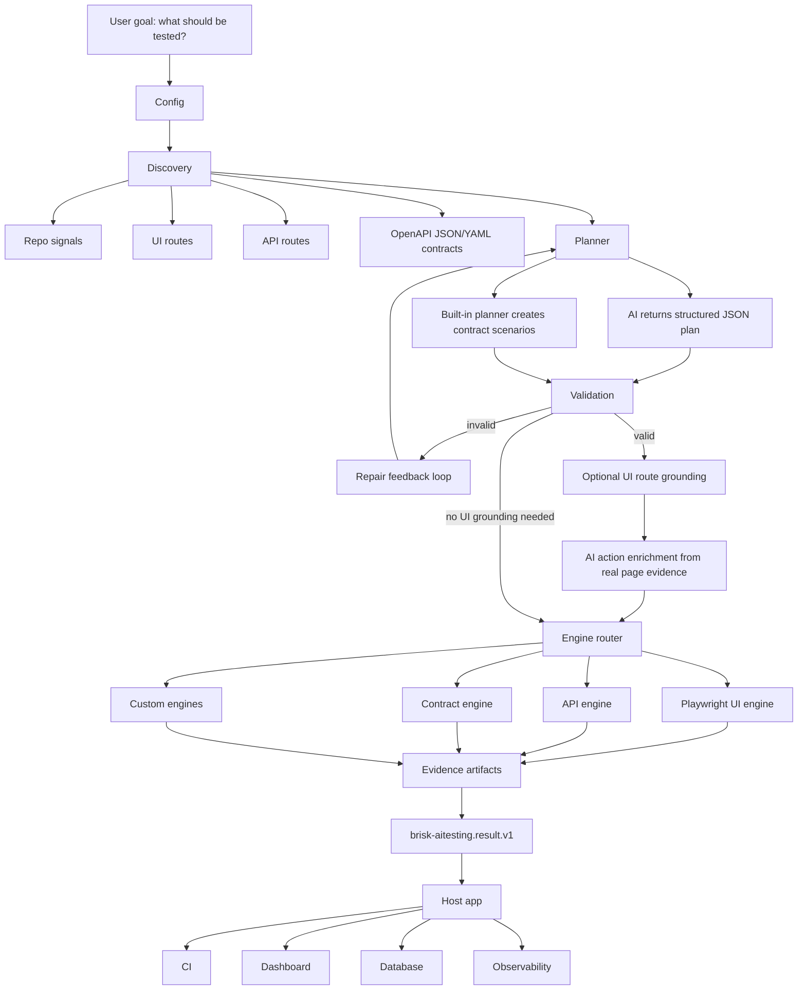

# brisk-aitesting

**AI testing for a world where software is being built faster than humans can manually verify it.**

`brisk-aitesting` is an AI-native, provider-agnostic testing engine for SaaS products, APIs, UI workflows, OpenAPI contracts, and custom systems.

The promise is simple:

```text
Tell it what to test.
It discovers what exists.
It chooses the right test type.
It generates a safe test plan.
It runs the right engines.
It returns clean evidence your product can consume.
```

This is not just a wrapper around Playwright. Playwright is one engine. API checks, contract checks, schema validation, route discovery, AI planning, validation, repair, evidence capture, and handover are all first-class parts of the product.

## Why This Exists

Software testing is now a global problem.

AI is accelerating how fast software gets created. Anthropic CEO Dario Amodei said at a Council on Foreign Relations event that AI could write 90% of code in a short time window and eventually nearly all code. Google CEO Sundar Pichai said more than a quarter of new Google code was already AI-generated and then reviewed by engineers. Microsoft CTO Kevin Scott has publicly predicted that a very large share of code will be AI-generated within five years.

At the same time, testing remains expensive and fragmented. Mordor Intelligence estimates the software testing market at USD 54.44 billion in 2026, projected to reach USD 99.94 billion by 2031. Fortune Business Insights estimates the automation testing market at USD 20.60 billion in 2025, projected to reach USD 84.22 billion by 2034.

That means the world is producing software faster, but verification is still slow, manual, tool-heavy, and expensive.

The old workflow looks like this:

- Product teams explain what should be tested.
- Testers translate that into manual UAT steps.
- Automation engineers write Playwright, API, contract, or custom scripts.
- Different tools produce different reports.
- Developers still spend time finding what failed and why.
- Every company rebuilds the same testing pipeline again.

`brisk-aitesting` is built to turn that into one enterprise solution:

- Say the goal in plain language.
- Let discovery inspect the app, repo, routes, and contracts.
- Let AI create a structured JSON plan, not unsafe code.
- Validate and repair the plan before execution.
- Ground UI actions against real page evidence.
- Execute with the right engines.
- Return one stable handover object for CI, dashboards, databases, or internal platforms.

Sources:

- [Council on Foreign Relations: Dario Amodei CEO Speaker Series](https://www.cfr.org/event/ceo-speaker-series-dario-amodei-anthropic)
- [The Verge: more than a quarter of new code at Google is generated by AI](https://www.theverge.com/2024/10/29/24282757/google-new-code-generated-ai-q3-2024)
- [Business Insider: Microsoft CTO prediction on AI-generated code](https://www.businessinsider.com/microsoft-cto-ai-generated-code-software-developer-job-change-2025-4)
- [Mordor Intelligence: software testing market](https://www.mordorintelligence.com/industry-reports/software-testing-market)
- [Fortune Business Insights: automation testing market](https://www.fortunebusinessinsights.com/automation-testing-market-107180)

## What It Solves

`brisk-aitesting` helps teams avoid the biggest testing bottlenecks:

- No need to hand-code every test from scratch.
- No need to force every scenario into only browser automation.
- No need to trust raw AI-generated TypeScript.
- No need to build a database or dashboard into the engine.
- No need to throw away existing host-app configuration.
- No need to guess selectors from AI output.

The engine is designed for:

- SaaS platforms
- internal enterprise apps
- local developer repos
- API-first products
- OpenAPI-backed services
- browser workflows
- CI pipelines
- custom test engines

## What It Can Do

`brisk-aitesting` is designed to be the testing brain and execution layer that a product team can plug into its own SaaS, repo, CI, or internal platform.

It can:

- inspect the repository itself
- identify backend frameworks and application structure
- discover backend routes from source code
- discover UI routes separately
- locate OpenAPI contract files in JSON or YAML
- correlate contracts with implemented routes
- detect routes that exist in code but are missing from contracts
- detect contract operations that do not appear to have matching implementation signals
- generate positive API scenarios from OpenAPI request schemas
- generate negative API scenarios from OpenAPI request schemas
- validate runtime API responses against OpenAPI response schemas
- check HTTP status codes, response bodies, headers, and schema expectations
- route different scenarios into UI, API, contract, schema, replay, or custom engines
- run browser workflows through Playwright
- ground UI actions in observed page evidence such as roles, labels, text, test IDs, and stable selectors
- prevent unsafe test execution by validating every plan before engines run
- repair invalid structured plans through a validation feedback loop
- produce unified, versioned, machine-consumable result JSON
- produce evidence artifacts for API calls, browser runs, contracts, logs, traces, screenshots, and generated specs
- work as a local SDK
- work as a CLI
- run without a proprietary hosted platform
- let host products own their own database, dashboard, CI, and observability flow
- accept host-app configuration through a bridge instead of forcing duplicate setup
- support provider-agnostic AI configuration through environment variables or custom providers
- support custom engines for systems outside the built-in UI/API/contract scope

In simple words:

```text
It does not only click screens.
It understands app surfaces, plans tests, chooses engines, runs checks, and returns evidence.
```

## What It Cannot Do Yet

`brisk-aitesting` is powerful, but it is not pretending to be every testing product in the world on day one.

Current product boundaries:

- It does not replace all specialized performance testing tools yet.
- It does not replace full security penetration testing platforms yet.
- It does not provide a hosted dashboard yet.
- It does not provide built-in long-term test history storage yet.
- It does not publish JUnit or HTML reports yet, although the result contract is ready for those outputs.
- It does not run native mobile app tests without a custom mobile engine.
- It does not run desktop app tests without a custom desktop engine.
- It does not deeply validate databases, queues, streams, or non-HTTP systems without custom engines.
- It does not automatically create safe test data for every enterprise system yet.
- It does not guarantee good UI grounding for apps with no accessible labels, roles, text, test IDs, or stable selectors.
- It does not bypass network, auth, firewall, VPN, or environment restrictions.
- It does not remove the need for product owners to describe high-value workflows and expected business behavior.

Compared with single-purpose tools:

- Playwright is excellent for browser automation; `brisk-aitesting` uses it as one engine inside a larger testing pipeline.
- API clients are excellent for sending requests; `brisk-aitesting` connects API testing with discovery, contracts, schemas, and unified results.
- Contract tools are excellent for contract checks; `brisk-aitesting` connects contracts to runtime execution and scenario generation.
- Test management tools are excellent for tracking work; `brisk-aitesting` focuses on generating, executing, and handing over evidence that those systems can consume.

## Where It Works Best

`brisk-aitesting` is strongest when the app exposes one or more of these surfaces:

- a browser UI reachable through `http://localhost`, staging, or an allowed host
- HTML elements with accessible labels, roles, text, or test IDs
- REST APIs reachable over HTTP
- OpenAPI 3.x contracts in JSON or YAML
- a local repository that can be inspected for routes, framework signals, and package metadata
- CI environments where JSON artifacts can be stored or uploaded

Most compatible today:

| Area | Current fit |
| --- | --- |
| Frontend apps | React, Next.js, Vite, Angular, Vue, Svelte, static HTML, and most browser-rendered apps that Playwright can open |
| Backend APIs | Node.js, Express, NestJS, Next.js API routes, Fastify, Python/FastAPI, Django REST, Flask, Java/Spring, .NET APIs, Go APIs, Rails APIs, or any backend with HTTP endpoints |
| API contracts | OpenAPI 3.x JSON/YAML |
| UI testing | Browser flows through Playwright |
| API testing | HTTP request/response checks, status checks, JSON body checks, OpenAPI response schema validation |
| Auth | no auth, credentials, bearer token, or host-provided custom auth metadata |
| AI providers | built-in OpenAI/OpenAI-compatible chat-completions path, plus custom `AiPlannerProvider` adapters |
| Storage | host-owned database, CI artifact store, dashboard, logs, or observability pipeline |

Works with custom engines:

- databases
- queues and messaging systems
- event streams
- mobile apps
- desktop apps
- non-HTTP protocols
- proprietary enterprise platforms
- mainframe or legacy systems

Not a good fit yet without extension:

- apps that cannot be reached by the runtime network
- UIs that block automation completely
- pages with no stable accessible labels, roles, text, test IDs, or usable selectors
- native mobile apps without a mobile engine
- binary protocols without a custom engine
- systems where the product owner cannot provide auth, base URL, contracts, or safe test data

Simple rule:

```text
If Playwright can open it, API calls can reach it, or OpenAPI can describe it, brisk-aitesting can test it today.
If it needs a special runtime, add a custom engine and keep the same planning/result contract.
```

## Architecture



Core rule:

```text
AI plans.
Validators decide if the plan is executable.
Engines execute.
Evidence proves what happened.
The host app owns storage and presentation.
```

## Install

### Current GitHub Install

The package has not been published to the npm registry yet. Until the first npm release, install it from GitHub:

```bash
npm install github:oshjain/brisk-aitesting
```

Then create a config:

```bash
npx brisk-aitesting init
```

### Local Development Install

For contributors:

```bash
git clone https://github.com/oshjain/brisk-aitesting.git
cd brisk-aitesting
npm install
npm run build
npm link
```

Inside a host app:

```bash
npm link brisk-aitesting
```

### Future npm Install

After the package is published to npm, this will be the normal install path:

```bash
npm install brisk-aitesting
```

## Quick Start

Create `brisk-aitesting.config.ts`:

```ts
import { defineConfig } from 'brisk-aitesting';

export default defineConfig({
  app: {
    name: 'My SaaS',
    baseUrl: 'http://localhost:3000',
    repoPath: '.',
  },
  auth: { type: 'none' },
  ai: {
    provider: 'openai',
    model: requiredEnv('BRISK_AITESTING_AI_MODEL'),
    apiKeyEnv: 'BRISK_AITESTING_AI_API_KEY',
    repairAttempts: 2,
    maxTokens: 4096,
    temperature: 0.1,
  },
  runtime: {
    artifactsDir: '.brisk-aitesting/artifacts',
    timeoutMs: 120000,
    retries: 1,
    headless: true,
    dryRun: false,
  },
  discovery: {
    includeRepo: true,
    includeUi: true,
    includeApi: true,
    includeContracts: true,
  },
  security: {
    networkPolicy: 'localhost-only',
    allowedHosts: ['localhost', '127.0.0.1', '::1'],
    redactSecrets: true,
  },
});

function requiredEnv(name: string): string {
  const value = process.env[name];
  if (value === undefined || value.trim().length === 0) {
    throw new Error(`${name} is required`);
  }
  return value;
}
```

Run a test goal:

```bash
npx brisk-aitesting run \
  --goal "Test login, permissions, dashboard, API contracts, and critical workflows" \
  --scenarios 15 \
  --mode automatic \
  --ui-action-feedback when-missing
```

Machine-readable output:

```bash
npx brisk-aitesting run \
  --goal "Test OpenAPI contracts and critical API paths" \
  --scenarios 10 \
  --json \
  --output .brisk-aitesting/latest-result.json
```

CLI exit codes:

```text
0  run completed and passed
1  run completed but failed, errored, or skipped
2  usage, config, provider, or runtime setup error
```

## AI Provider Setup

Use the `BRISK_AITESTING_*` namespace for product configuration:

```bash
BRISK_AITESTING_AI_PROVIDER=openai
BRISK_AITESTING_AI_MODEL=your-model
BRISK_AITESTING_AI_API_KEY=your-api-key
```

For any OpenAI-compatible provider or internal gateway:

```ts
ai: {
  provider: 'openai-compatible',
  endpoint: requiredEnv('BRISK_AITESTING_AI_ENDPOINT'),
  model: requiredEnv('BRISK_AITESTING_AI_MODEL'),
  apiKeyEnv: 'BRISK_AITESTING_AI_API_KEY',
}
```

What can go in provider config:

- `provider`: built-in provider adapter name.
- `endpoint`: optional chat-completions endpoint for OpenAI-compatible gateways.
- `model`: model name controlled by your environment.
- `apiKeyEnv`: environment variable name that stores the key.
- `apiKey`: direct key for advanced host-managed setups.
- `caCertPath`: optional PEM file for enterprise TLS trust.
- `maxTokens`: maximum AI response size.
- `temperature`: generation temperature.
- `repairAttempts`: how many times invalid AI plans can be repaired.

Provider-specific environment variables are compatibility aliases only. Product integrations should prefer `BRISK_AITESTING_*`.

## Host App Config Bridge

Big SaaS products already have app URLs, auth, AI settings, and environment config. They should not duplicate everything just for testing.

Use `defineConfigFromHost` to map existing host config into `brisk-aitesting`:

```ts
import { defineConfigFromHost, mergeConfig } from 'brisk-aitesting';

const testingConfig = defineConfigFromHost(hostConfig, (host) => ({
  app: {
    name: host.productName,
    baseUrl: host.urls.staging,
    repoPath: host.paths.repo,
  },
  auth: host.testing.auth,
  ai: {
    provider: host.ai.provider,
    endpoint: host.ai.endpoint,
    model: host.ai.model,
    apiKey: host.ai.apiKey,
    caCertPath: host.ai.caCertPath,
  },
}));

export default mergeConfig(testingConfig, {
  runtime: {
    artifactsDir: '.brisk-aitesting/artifacts',
    timeoutMs: 120000,
    retries: 1,
    headless: true,
    dryRun: false,
  },
});
```

Think of it like an adapter plug: the host app keeps its own source of truth, and `brisk-aitesting` receives only the values it needs.

## How AI Is Controlled

AI does not write trusted executable scripts directly.

The AI planner returns JSON shaped as `brisk-aitesting.plan.v1`. The engine then:

```text
extracts JSON
normalizes safe aliases
injects discovered routes when needed
validates structure and executability
repairs invalid plans through feedback
grounds UI steps against real page evidence
routes each scenario to the right engine
```

This is the safety model:

- AI can suggest what should be tested.
- AI can choose whether a scenario is UI, API, contract, schema, or custom.
- AI can enrich UI actions only from captured page evidence.
- AI cannot invent selectors and force execution.
- AI cannot bypass validation.
- Engines produce evidence for every executable result.

## Built-In Engines

- `BuiltinPlaywrightEngine`: runs browser workflows and grounded UI actions.
- `BuiltinApiEngine`: runs HTTP checks and validates response schemas when OpenAPI schemas exist.
- `BuiltinContractEngine`: reads OpenAPI JSON/YAML and emits operation summaries.
- Custom engines can be plugged in for database, messaging, replay, mobile, or enterprise-specific systems.

## Handover Contract

`brisk-aitesting` does not require a database.

It returns one stable object that any host system can store, split, render, or send to CI:

```ts
{
  schemaVersion: 'brisk-aitesting.result.v1',
  runId: string,
  status: 'passed' | 'failed' | 'error' | 'skipped',
  summary: {
    total: number,
    passed: number,
    failed: number,
    skipped: number,
    errors: number,
    passRate: number,
    durationMs: number
  },
  plan: {},
  tests: [],
  artifacts: [],
  diagnosis: [],
  handover: {}
}
```

Your SaaS can use this result for:

- CI pass/fail gates
- dashboard cards
- test history
- database persistence
- audit logs
- traces and screenshots
- analytics

## Stable Schemas

```text
brisk-aitesting.plan.v1
brisk-aitesting.validation.v1
brisk-aitesting.discovery.v1
brisk-aitesting.result.v1
brisk-aitesting.handover.v1
brisk-aitesting.cli-result.v1
brisk-aitesting.benchmark.v1
brisk-aitesting.pack-check.v1
brisk-aitesting.api-evidence.v1
brisk-aitesting.openapi-summary.v1
brisk-aitesting.playwright-evidence.v1
brisk-aitesting.ui-grounding.v1
brisk-aitesting.ui-actions.v1
```

## Release Gate

Before a release:

```bash
npm run typecheck
npm run build
npm run smoke:ci
npm run benchmark
npm run smoke:real-ai
```

`smoke:ci` runs deterministic checks:

- contract/schema registry checks
- CLI checks
- AI fixture repair checks
- full engine smoke checks
- npm pack safety checks

`benchmark` runs adversarial checks for malformed contracts, invalid AI output, schema mismatches, undocumented statuses, blocked network calls, and CLI setup errors.

`smoke:real-ai` uses real provider credentials from `.env.local` or the environment. It is intentionally separate from CI because enterprise networks may require CA certificates or provider-specific routing.

## Current Status

Built:

- AI planning with JSON plan boundary
- validation and repair loop
- route discovery
- OpenAPI JSON/YAML support
- generated API contract scenarios
- response schema validation with AJV
- grounded UI action execution
- Playwright/API/contract engines
- CLI with stable exit codes
- handover JSON contract
- deterministic CI gate
- adversarial benchmark suite
- npm pack safety check
- real AI smoke path

Still future work:

- npm registry publication
- multi-provider benchmark scoring
- JUnit/HTML report generation
- built-in analytics module
- more framework-specific examples

## Contributors

Main contributor and product visionary:

- Hasmukh Jain

## License

MIT
