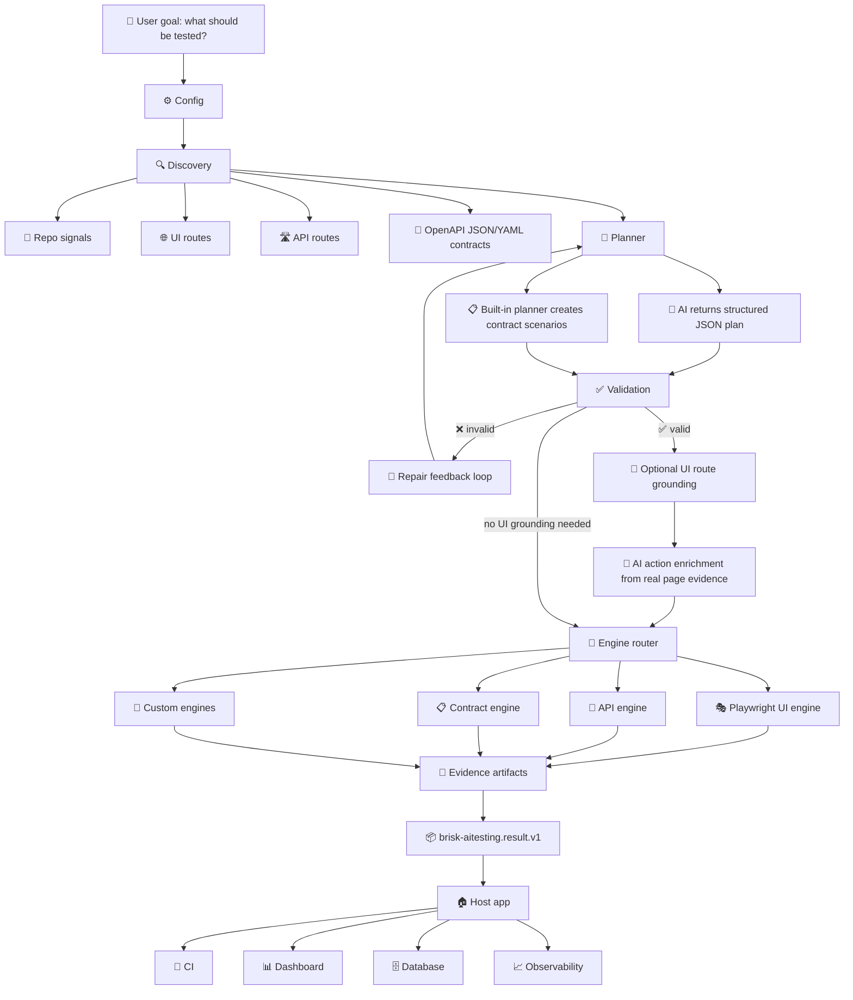

<div align="center">
  
  <h1>brisk-aitesting</h1>
  <p><strong>Fast, No-nonsense and Effective</strong></p>

  <!-- Badges -->
  <p>
    
    
    
    
    
  </p>
</div>

<br />

<!-- Hero -->
<div align="center">
  <blockquote>
    <strong>AI testing for a world where software is being built faster than humans can manually verify it.</strong>
  </blockquote>
</div>

<br />

`brisk-aitesting` helps teams turn a plain testing goal into real, runnable checks for SaaS products, APIs, UI flows, OpenAPI contracts, and custom systems.

<div align="center">
  <h3>A local AI testing layer developers can actually embed</h3>
  <p>
    It studies your app, asks AI for a structured test plan, checks that plan, runs the right tools, and returns evidence your product can use.
  </p>
</div>

<br />

<!-- The Promise Card -->
<table>
  <tr>
    <td align="center">
      <h3>🎯 The Promise</h3>
      <blockquote>
        <em>Tell it what to test.<br />
        It discovers what exists.<br />
        It chooses the right test type.<br />
        It generates a safe test plan.<br />
        It runs the right engines.<br />
        It returns clean evidence your product can use.</em>
      </blockquote>
      <br />
      <sub>This is <strong>not</strong> just a wrapper around Playwright. Playwright is one built-in engine. API checks, OpenAPI contract checks, schema validation, route discovery, AI planning, validation, repair, evidence capture, and result handover are also part of the product.</sub>
    </td>
  </tr>
</table>

## Plain English

`brisk-aitesting` is not "AI writes random Playwright code and runs it."

It is closer to a careful testing assistant with a factory line behind it:

| Step | What happens |
|:----:|:-------------|
| 1 | It looks at your repo, routes, UI pages, and OpenAPI files. |
| 2 | It asks AI to create a structured test plan in JSON. |
| 3 | It checks and repairs that plan before anything is allowed to run. |
| 4 | It sends each test to the right built-in engine: browser, API, or OpenAPI contract. |
| 5 | It collects screenshots, traces, request/response data, logs, and final results. |
| 6 | It gives your app one stable JSON result that you can store, show, or send to CI. |

The most important idea is simple:

```text
AI suggests the plan.
Brisk checks the plan.
Engines run the tests.
Evidence shows what actually happened.
```

## Built Now vs Not Built Yet

This section exists so there is no confusion.

| Area | Status today | What users get |
|:-----|:-------------|:---------------|
| UI testing | Built | Browser tests through Playwright with grounded page evidence. |
| API testing | Built | HTTP checks, status checks, body checks, headers, and schema-backed response checks. |
| OpenAPI testing | Built | JSON/YAML contract parsing, route discovery, positive and negative API scenarios, response schema validation. |
| AI planning | Built | AI returns JSON plans. Plans are normalized, validated, and repaired before execution. |
| Result handover | Built | One versioned JSON result for CI, dashboards, databases, and internal tools. |
| Local SDK/CLI | Built | Use it inside your app or from the command line. No hosted platform required. |
| Schemathesis OpenAPI fuzz adapter | Built | Optional Python/Schemathesis engine for real OpenAPI fuzz and negative testing. |
| JS-native schema fuzz engine | Not built-in yet | Planned: lighter built-in negative API testing from schemas. |
| Replay engine | Not built-in yet | Planned: replay captured traffic for fast regression checks. |
| AsyncAPI/Pact/message testing | Not built-in yet | Planned: event and message contract testing. |
| Specmatic/Keploy adapters | Not built-in yet | Planned as optional adapters, not core promises today. |
| UI healing | Not built-in yet | Planned: retry failed UI selectors using fresh page evidence and report what changed. |
| Serious SaaS reference app | Built | Proves auth, roles, UI, API, OpenAPI, negative cases, state change, and artifacts. |
| Full reference app matrix | Not built yet | Planned: Todo, e-commerce, API-only, multi-tenant, and event/messaging apps. |
| Built-in engine conformance suite | Built | Built-in engines must return stable result and artifact shapes. |
| Engine plugin conformance suite | Built | External engines must prove scenario routing, result shape, artifact shape, timeout handling, and secret safety before being trusted. |
| Non-engine plugin conformance | Not built yet | Planned: conformance for custom discoverers, planners, validators, UI grounders, and AI providers. |

Future work is only worth adding when it clearly helps users:

| Future work | User impact |
|:------------|:------------|
| Reference apps | More confidence that Brisk works on real app shapes. |
| Golden fixtures | Less chance that future changes quietly weaken plans. |
| Plugin conformance | Safer third-party and internal engines, before they are trusted. |
| Schemathesis adapter | More OpenAPI bugs caught without slow browser tests. |
| JS-native schema fuzz engine | Faster lightweight schema checks without Python. |
| Replay engine | Faster regression checks from known traffic. |
| Message adapters | Coverage beyond HTTP and browser workflows. |
| UI healing | Fewer flaky browser failures, with evidence when healing happens. |

## 🌍 Why This Exists

Software testing is now a **global problem**.

AI is accelerating how fast software gets created. Industry leaders are clear:

<br />

<!-- Executive Quotes -->
<table>
  <tr>
    <td width="33%" align="center">
      <blockquote>AI could write <strong>90% of code</strong> in a short time window and eventually nearly all code.</blockquote>
      <sub>— <strong>Dario Amodei</strong>, Anthropic CEO<br />
      <a href="https://www.cfr.org/event/ceo-speaker-series-dario-amodei-anthropic">Council on Foreign Relations</a></sub>
    </td>
    <td width="33%" align="center">
      <blockquote>More than a <strong>quarter of new Google code</strong> was already AI-generated and then reviewed by engineers.</blockquote>
      <sub>— <strong>Sundar Pichai</strong>, Google CEO<br />
      <a href="https://www.theverge.com/2024/10/29/24282757/google-new-code-generated-ai-q3-2024">The Verge</a></sub>
    </td>
    <td width="33%" align="center">
      <blockquote>A <strong>very large share</strong> of code will be AI-generated within five years.</blockquote>
      <sub>— <strong>Kevin Scott</strong>, Microsoft CTO<br />
      <a href="https://www.businessinsider.com/microsoft-cto-ai-generated-code-software-developer-job-change-2025-4">Business Insider</a></sub>
    </td>
  </tr>
</table>

<br />

Yet testing remains **expensive and fragmented**.

<!-- Market Stats -->
<table>
  <tr>
    <td align="center" bgcolor="f0f8ff">
      <h3>💰 $54.44B</h3>
      <sub>Software testing market (2026)</sub>
    </td>
    <td align="center" bgcolor="f0f8ff">
      <h3>📈 $99.94B</h3>
      <sub>Projected by 2031</sub>
    </td>
    <td align="center" bgcolor="fff0f0">
      <h3>💰 $20.60B</h3>
      <sub>Automation testing market (2025)</sub>
    </td>
    <td align="center" bgcolor="fff0f0">
      <h3>📈 $84.22B</h3>
      <sub>Projected by 2034</sub>
    </td>
  </tr>
  <tr>
    <td colspan="4" align="center">
      <sub>
        <a href="https://www.mordorintelligence.com/industry-reports/software-testing-market">Mordor Intelligence</a>
        &nbsp;·&nbsp;
        <a href="https://www.fortunebusinessinsights.com/automation-testing-market-107180">Fortune Business Insights</a>
      </sub>
    </td>
  </tr>
</table>

<br />

> **The world is producing software faster, but verification is still slow, manual, tool-heavy, and expensive.**

<br />

### ❌ The Old Workflow

| Step | Who | Pain |
|:----:|:---:|:----:|
| 1 | Product teams | Explain what should be tested |
| 2 | Testers | Translate into manual UAT steps |
| 3 | Automation engineers | Write Playwright, API, contract, or custom scripts |
| 4 | Multiple tools | Produce different reports |
| 5 | Developers | Spend time finding what failed and why |
| 6 | Everyone | Rebuild the same testing pipeline again |

### ✅ The brisk-aitesting Solution

| Step | What happens |
|:----:|:------------|
| 1 | Say the goal in **plain language** |
| 2 | Let **discovery** inspect the app, repo, routes, and contracts |
| 3 | Let **AI** create a structured JSON plan, not unsafe code |
| 4 | **Validate and repair** the plan before execution |
| 5 | **Ground** UI actions against real page evidence |
| 6 | **Execute** with the right engines |
| 7 | Return **one stable handover object** for CI, dashboards, databases, or internal platforms |

## 🎯 What It Solves

`brisk-aitesting` helps teams avoid the biggest testing bottlenecks:

<!-- Bottleneck Cards -->
<table>
  <tr>
    <td>❌ <strong>No need</strong> to hand-code every test from scratch</td>
    <td>❌ <strong>No need</strong> to force every scenario into only browser automation</td>
  </tr>
  <tr>
    <td>❌ <strong>No need</strong> to trust raw AI-generated TypeScript</td>
    <td>❌ <strong>No need</strong> to build a database or dashboard into the engine</td>
  </tr>
  <tr>
    <td>❌ <strong>No need</strong> to throw away existing host-app configuration</td>
    <td>❌ <strong>No need</strong> to guess selectors from AI output</td>
  </tr>
</table>

<br />

### Designed For

<table>
  <tr>
    <td align="center">🏢</td>
    <td><strong>SaaS platforms</strong></td>
    <td align="center">🏭</td>
    <td><strong>Internal enterprise apps</strong></td>
  </tr>
  <tr>
    <td align="center">💻</td>
    <td><strong>Local developer repos</strong></td>
    <td align="center">🔌</td>
    <td><strong>API-first products</strong></td>
  </tr>
  <tr>
    <td align="center">📋</td>
    <td><strong>OpenAPI-backed services</strong></td>
    <td align="center">🌐</td>
    <td><strong>Browser workflows</strong></td>
  </tr>
  <tr>
    <td align="center">🔄</td>
    <td><strong>CI pipelines</strong></td>
    <td align="center">⚙️</td>
    <td><strong>Custom test engines</strong></td>
  </tr>
</table>

## 🚀 What It Can Do

`brisk-aitesting` is designed to be the **embedded testing layer** that a product team can plug into its own SaaS, repo, CI, or internal platform.

<br />

<div align="center">
  <blockquote><em>It does not only click screens.<br />It understands app surfaces, plans tests, chooses engines, runs checks, and returns evidence.</em></blockquote>
</div>

<br />

### 🔍 Discovery & Inspection

<table>
  <tr>
    <td>📂</td>
    <td>Inspect the repository itself</td>
    <td>🔧</td>
    <td>Identify backend frameworks and application structure</td>
  </tr>
  <tr>
    <td>🛣️</td>
    <td>Discover backend routes from source code</td>
    <td>🌐</td>
    <td>Discover UI routes separately</td>
  </tr>
  <tr>
    <td>📄</td>
    <td>Locate OpenAPI contract files in JSON or YAML</td>
    <td>🔗</td>
    <td>Correlate contracts with implemented routes</td>
  </tr>
  <tr>
    <td>⚠️</td>
    <td>Detect routes that exist in code but are missing from contracts</td>
    <td>🔍</td>
    <td>Detect contract operations without matching implementation signals</td>
  </tr>
</table>

### 🧪 Test Generation & Validation

<table>
  <tr>
    <td>✅</td>
    <td>Generate <strong>positive</strong> API scenarios from OpenAPI request schemas</td>
    <td>❌</td>
    <td>Generate <strong>negative</strong> API scenarios from OpenAPI request schemas</td>
  </tr>
  <tr>
    <td>📊</td>
    <td>Validate runtime API responses against OpenAPI response schemas</td>
    <td>🔢</td>
    <td>Check HTTP status codes, response bodies, headers, and schema expectations</td>
  </tr>
  <tr>
    <td>🔄</td>
    <td>Route built-in scenarios into UI, API, and OpenAPI contract engines</td>
    <td>🎭</td>
    <td>Run browser workflows through Playwright</td>
  </tr>
  <tr>
    <td>🎯</td>
    <td>Ground UI actions in observed page evidence (roles, labels, text, test IDs, stable selectors)</td>
    <td>🛡️</td>
    <td>Prevent unsafe test execution by validating every plan before engines run</td>
  </tr>
  <tr>
    <td>🔧</td>
    <td>Repair invalid structured plans through a validation feedback loop</td>
    <td>🧩</td>
    <td>Accept custom engines for schema fuzzing, replay, messaging, database, mobile, or enterprise-specific systems</td>
  </tr>
  <tr>
    <td>📝</td>
    <td>Turn user-supplied business intent into executable scenarios</td>
    <td>🔍</td>
    <td>Preserve objectives and assertions so business meaning stays visible in the result</td>
  </tr>
  <tr>
    <td>🧾</td>
    <td>Check exact values, ranges, JSON fields, status codes, and schema-backed response shapes</td>
    <td></td>
    <td></td>
  </tr>
</table>

### 🧭 Business Intent as Executable Scenarios

`brisk-aitesting` does not need to magically discover every business rule in a company. The practical model is simpler and stronger:

```text
Brisk discovers the application's testable surfaces.
The user supplies the important business intent.
The planner maps that intent to UI, API, and contract checks.
Engines execute the checks and return evidence.
```

For example, a user can say:

```text
Given a booking date after vessel departure,
when a booking is created,
then the API must reject it with VESSEL_ALREADY_DEPARTED.
```

That is already a business rule expressed as an executable scenario. A formal rule registry can come later, but the first useful unit is simple: context, action, expected outcome, and evidence.

### 📦 Output & Integration

<table>
  <tr>
    <td>📋</td>
    <td>Produce unified, versioned, machine-consumable result JSON</td>
    <td>📎</td>
    <td>Produce evidence artifacts for API calls, browser runs, contracts, logs, traces, screenshots, and generated specs</td>
  </tr>
  <tr>
    <td>💻</td>
    <td>Work as a local <strong>SDK</strong></td>
    <td>⌨️</td>
    <td>Work as a <strong>CLI</strong></td>
  </tr>
  <tr>
    <td>☁️</td>
    <td>Run without a proprietary hosted platform</td>
    <td>🏠</td>
    <td>Let host products own their own database, dashboard, CI, and observability flow</td>
  </tr>
  <tr>
    <td>🔌</td>
    <td>Accept host-app configuration through a bridge instead of forcing duplicate setup</td>
    <td>🤖</td>
    <td>Support provider-agnostic AI configuration through environment variables or custom providers</td>
  </tr>
  <tr>
    <td>🧩</td>
    <td>Support custom engines for systems outside the built-in UI/API/contract scope</td>
    <td></td>
    <td></td>
  </tr>
</table>

## ⏳ What It Cannot Do Yet

`brisk-aitesting` is powerful, but it is not pretending to be every testing product in the world on day one.

<br />

### Current Product Boundaries

<table>
  <tr>
    <td>📊</td>
    <td>It does <strong>not</strong> replace all specialized <strong>performance testing</strong> tools yet</td>
  </tr>
  <tr>
    <td>🔒</td>
    <td>It does <strong>not</strong> replace full <strong>security penetration testing</strong> platforms yet</td>
  </tr>
  <tr>
    <td>📈</td>
    <td>It does <strong>not</strong> provide a hosted <strong>dashboard</strong> yet</td>
  </tr>
  <tr>
    <td>🗄️</td>
    <td>It does <strong>not</strong> provide built-in long-term test <strong>history storage</strong> yet</td>
  </tr>
  <tr>
    <td>📄</td>
    <td>It does <strong>not</strong> publish <strong>JUnit or HTML reports</strong> yet — although the result contract is ready for those outputs</td>
  </tr>
  <tr>
    <td>📱</td>
    <td>It does <strong>not</strong> run native <strong>mobile</strong> app tests without a custom mobile engine</td>
  </tr>
  <tr>
    <td>🖥️</td>
    <td>It does <strong>not</strong> run <strong>desktop</strong> app tests without a custom desktop engine</td>
  </tr>
  <tr>
    <td>🗃️</td>
    <td>It does <strong>not</strong> deeply validate <strong>databases, queues, streams, or non-HTTP systems</strong> without custom engines</td>
  </tr>
  <tr>
    <td>🧪</td>
    <td>It does <strong>not</strong> automatically create safe test data for every enterprise system yet</td>
  </tr>
  <tr>
    <td>🎯</td>
    <td>It does <strong>not</strong> guarantee good UI grounding for apps with no accessible labels, roles, text, test IDs, or stable selectors</td>
  </tr>
  <tr>
    <td>🌐</td>
    <td>It does <strong>not</strong> bypass network, auth, firewall, VPN, or environment restrictions</td>
  </tr>
  <tr>
    <td>📝</td>
    <td>It does <strong>not</strong> remove the need for product owners to describe high-value workflows and expected business behavior</td>
  </tr>
</table>

<br />

### Compared with Single-Purpose Tools

| Tool | What it does | How brisk fits |
|:----:|:------------|:--------------|
| 🎭 **Playwright** | Excellent for browser automation | brisk-aitesting uses it as **one engine** inside a larger testing pipeline |
| 📡 **API Clients** | Excellent for sending requests | brisk-aitesting connects API testing with **discovery, contracts, schemas, and unified results** |
| 📋 **Contract Tools** | Excellent for contract checks | brisk-aitesting connects contracts to **runtime execution and scenario generation** |
| ✅ **Test Management** | Excellent for tracking work | brisk-aitesting focuses on **generating, executing, and handing over evidence** that those systems can consume |

## 🎯 Where It Works Best

`brisk-aitesting` is strongest when the app exposes one or more of these surfaces:

> 🌐 a browser UI reachable through `http://localhost`, staging, or an allowed host
> 🏷️ HTML elements with accessible labels, roles, text, or test IDs
> 🔗 REST APIs reachable over HTTP
> 📜 OpenAPI 3.x contracts in JSON or YAML
> 📁 a local repository that can be inspected for routes, framework signals, and package metadata
> 📦 CI environments where JSON artifacts can be stored or uploaded

<br />

### ✅ Most Compatible Today

| Area | Current fit |
|:----:|:------------|
| 🖥️ **Frontend apps** | React, Next.js, Vite, Angular, Vue, Svelte, static HTML, and most browser-rendered apps that Playwright can open |
| ⚙️ **Backend APIs** | Node.js, Express, NestJS, Next.js API routes, Fastify, Python/FastAPI, Django REST, Flask, Java/Spring, .NET APIs, Go APIs, Rails APIs, or any backend with HTTP endpoints |
| 📜 **API contracts** | OpenAPI 3.x JSON/YAML |
| 🎭 **UI testing** | Browser flows through Playwright |
| 📡 **API testing** | HTTP request/response checks, status checks, JSON body checks, OpenAPI response schema validation |
| 🔑 **Auth** | no auth, credentials, bearer token, or host-provided custom auth metadata |
| 🤖 **AI providers** | built-in OpenAI/OpenAI-compatible chat-completions path, plus custom `AiPlannerProvider` adapters |
| 💾 **Storage** | host-owned database, CI artifact store, dashboard, logs, or observability pipeline |

<br />

### 🧩 Works with Custom Engines

<table>
  <tr>
    <td>🗄️ Databases</td>
    <td>📨 Queues and messaging systems</td>
    <td>📊 Event streams</td>
  </tr>
  <tr>
    <td>📱 Mobile apps</td>
    <td>🖥️ Desktop apps</td>
    <td>🔗 Non-HTTP protocols</td>
  </tr>
  <tr>
    <td>🏢 Proprietary enterprise platforms</td>
    <td>🖧 Mainframe or legacy systems</td>
    <td></td>
  </tr>
</table>

<br />

### ⚠️ Not a Good Fit Yet (Without Extension)

| Reason | Detail |
|:-----:|:-------|
| 🌐 | Apps that cannot be reached by the runtime network |
| 🚫 | UIs that block automation completely |
| 🏷️ | Pages with no stable accessible labels, roles, text, test IDs, or usable selectors |
| 📱 | Native mobile apps without a mobile engine |
| 🔢 | Binary protocols without a custom engine |
| 🔐 | Systems where the product owner cannot provide auth, base URL, contracts, or safe test data |

<br />

### Simple Rule

<div align="center">
  <table>
    <tr>
      <td align="center">
        <blockquote>
          <strong>If Playwright can open it, API calls can reach it, or OpenAPI can describe it, brisk-aitesting can test it today.</strong><br />
          <em>If it needs a special runtime, add a custom engine and keep the same planning/result contract.</em>
        </blockquote>
      </td>
    </tr>
  </table>
</div>

## 🏗️ Architecture



<br />

### Core Rule

<div align="center">
  <table>
    <tr>
      <td align="center" width="25%"><strong>🧠 AI plans.</strong></td>
      <td align="center" width="25%"><strong>✅ Validators decide</strong> if the plan is executable.</td>
      <td align="center" width="25%"><strong>⚙️ Engines execute.</strong></td>
      <td align="center" width="25%"><strong>📎 Evidence</strong> proves what happened.</td>
    </tr>
    <tr>
      <td align="center" colspan="4"><strong>🏠 The host app owns storage and presentation.</strong></td>
    </tr>
  </table>
</div>

## 📦 Install

<table>
  <tr>
    <td width="33%" valign="top" align="center">

### 🌟 Current: npm Install

```bash
npm install brisk-aitesting
```

Then create a config:

```bash
npx brisk-aitesting init
```

    </td>
    <td width="33%" valign="top" align="center">

### 🛠️ Local Development Install

<sub>For contributors:</sub>

```bash
git clone https://github.com/oshjain/brisk-aitesting.git
cd brisk-aitesting
npm install
npm run build
npm link
```

Inside a host app:

```bash
npm link brisk-aitesting
```

    </td>
    <td width="33%" valign="top" align="center">

### 🐙 GitHub Install

```bash
npm install github:oshjain/brisk-aitesting
```

    </td>
  </tr>
</table>

## ⚡ Quick Start

<details open>
<summary><strong>1️⃣ Create your config</strong></summary>

Create `brisk-aitesting.config.ts`:

```ts
import { defineConfig } from 'brisk-aitesting';

export default defineConfig({
  app: {
    name: 'My SaaS',
    baseUrl: 'http://localhost:3000',
    repoPath: '.',
  },
  auth: { type: 'none' },
  ai: {
    provider: 'openai',
    model: requiredEnv('BRISK_AITESTING_AI_MODEL'),
    apiKeyEnv: 'BRISK_AITESTING_AI_API_KEY',
    repairAttempts: 2,
    maxTokens: 4096,
    temperature: 0.1,
  },
  runtime: {
    artifactsDir: '.brisk-aitesting/artifacts',
    timeoutMs: 120000,
    retries: 1,
    headless: true,
    dryRun: false,
  },
  discovery: {
    includeRepo: true,
    includeUi: true,
    includeApi: true,
    includeContracts: true,
  },
  security: {
    networkPolicy: 'localhost-only',
    allowedHosts: ['localhost', '127.0.0.1', '::1'],
    redactSecrets: true,
  },
});

function requiredEnv(name: string): string {
  const value = process.env[name];
  if (value === undefined || value.trim().length === 0) {
    throw new Error(`${name} is required`);
  }
  return value;
}
```

</details>

<details open>
<summary><strong>2️⃣ Run a test goal</strong></summary>

```bash
npx brisk-aitesting run \
  --goal "Test login, permissions, dashboard, API contracts, and critical workflows" \
  --scenarios 15 \
  --mode automatic \
  --ui-action-feedback when-missing
```

</details>

<details open>
<summary><strong>3️⃣ Get machine-readable output</strong></summary>

```bash
npx brisk-aitesting run \
  --goal "Test OpenAPI contracts and critical API paths" \
  --scenarios 10 \
  --json \
  --output .brisk-aitesting/latest-result.json
```

</details>

<br />

### CLI Exit Codes

| Code | Meaning |
|:----:|:--------|
| `0` | ✅ Run completed and **passed** |
| `1` | ❌ Run completed but **failed, errored, or skipped** |
| `2` | ⚠️ **Usage, config, provider, or runtime setup error** |

## 🤖 AI Provider Setup

Use the `BRISK_AITESTING_*` namespace for product configuration:

<br />

### Quick Environment Config

```bash
BRISK_AITESTING_AI_PROVIDER=openai
BRISK_AITESTING_AI_MODEL=your-model
BRISK_AITESTING_AI_API_KEY=your-api-key
```

<br />

### OpenAI-Compatible Providers

For any OpenAI-compatible provider or internal gateway:

```ts
ai: {
  provider: 'openai-compatible',
  endpoint: requiredEnv('BRISK_AITESTING_AI_ENDPOINT'),
  model: requiredEnv('BRISK_AITESTING_AI_MODEL'),
  apiKeyEnv: 'BRISK_AITESTING_AI_API_KEY',
}
```

<br />

### Provider Config Reference

| Property | Type | Description |
|:---------|:----:|:------------|
| `provider` | `string` | Built-in provider adapter name |
| `endpoint` | `string` | Optional chat-completions endpoint for OpenAI-compatible gateways |
| `model` | `string` | Model name controlled by your environment |
| `apiKeyEnv` | `string` | Environment variable name that stores the key |
| `apiKey` | `string` | Direct key for advanced host-managed setups |
| `caCertPath` | `string` | Optional PEM file for enterprise TLS trust |
| `maxTokens` | `number` | Maximum AI response size |
| `temperature` | `number` | Generation temperature |
| `repairAttempts` | `number` | How many times invalid AI plans can be repaired |

> 📝 **Note:** Provider-specific environment variables are compatibility aliases only. Product integrations should prefer `BRISK_AITESTING_*`.

## 🔌 Host App Config Bridge

Big SaaS products already have app URLs, auth, AI settings, and environment config. They should **not** duplicate everything just for testing.

<br />

<table>
  <tr>
    <td width="50%" valign="top">

### 🏠 Host App
<sub>(your source of truth)</sub>

```
┌──────────────────┐
│  productName     │
│  urls.staging    │
│  paths.repo      │
│  testing.auth    │
│  ai.provider     │
│  ai.endpoint     │
│  ai.model        │
│  ai.apiKey       │
│  ai.caCertPath   │
└──────────────────┘
```

    </td>
    <td width="50%" valign="top">

### 🔌 Adapter Plug

Use `defineConfigFromHost` to map existing host config into `brisk-aitesting`:

```ts
import { defineConfigFromHost, mergeConfig } from 'brisk-aitesting';

const testingConfig = defineConfigFromHost(
  hostConfig,
  (host) => ({
    app: {
      name: host.productName,
      baseUrl: host.urls.staging,
      repoPath: host.paths.repo,
    },
    auth: host.testing.auth,
    ai: {
      provider: host.ai.provider,
      endpoint: host.ai.endpoint,
      model: host.ai.model,
      apiKey: host.ai.apiKey,
      caCertPath: host.ai.caCertPath,
    },
  })
);

export default mergeConfig(testingConfig, {
  runtime: {
    artifactsDir: '.brisk-aitesting/artifacts',
    timeoutMs: 120000,
    retries: 1,
    headless: true,
    dryRun: false,
  },
});
```

    </td>
  </tr>
</table>

> 💡 **Think of it like an adapter plug:** the host app keeps its own source of truth, and `brisk-aitesting` receives only the values it needs.

## 🛡️ How AI Is Controlled

AI does **not** write trusted executable scripts directly.

<br />

### The Pipeline

The AI planner returns JSON shaped as `brisk-aitesting.plan.v1`. The engine then processes it through this pipeline:

<table>
  <tr>
    <td align="center">1️⃣</td>
    <td>📦</td>
    <td><strong>Extracts JSON</strong></td>
  </tr>
  <tr>
    <td align="center">2️⃣</td>
    <td>🔄</td>
    <td><strong>Normalizes</strong> safe aliases</td>
  </tr>
  <tr>
    <td align="center">3️⃣</td>
    <td>🛣️</td>
    <td><strong>Injects</strong> discovered routes when needed</td>
  </tr>
  <tr>
    <td align="center">4️⃣</td>
    <td>✅</td>
    <td><strong>Validates</strong> structure and executability</td>
  </tr>
  <tr>
    <td align="center">5️⃣</td>
    <td>🔧</td>
    <td><strong>Repairs</strong> invalid plans through feedback</td>
  </tr>
  <tr>
    <td align="center">6️⃣</td>
    <td>🎯</td>
    <td><strong>Grounds</strong> UI steps against real page evidence</td>
  </tr>
  <tr>
    <td align="center">7️⃣</td>
    <td>🚦</td>
    <td><strong>Routes</strong> each scenario to the right engine</td>
  </tr>
</table>

<br />

### The Safety Model

| Principle | Guard |
|:---------:|:------|
| 🤖 AI can **suggest** what should be tested | ✅ Allowed |
| 🤖 AI can **choose** whether a scenario is UI, API, contract, schema, replay, or custom | ✅ Allowed |
| 🤖 AI can **enrich UI actions** only from captured page evidence | ✅ Allowed |
| ❌ AI cannot **invent selectors** and force execution | 🚫 Blocked |
| ❌ AI cannot **bypass validation** | 🚫 Blocked |
| ⚙️ Engines produce **evidence** for every executable result | ✅ Guaranteed |

## ⚙️ Built-In Engines

<table>
  <tr>
    <td width="33%" valign="top" align="center">
      <h3>🎭 Playwright Engine</h3>
      <p><code>BuiltinPlaywrightEngine</code></p>
      <p>Runs browser workflows and grounded UI actions.</p>
    </td>
    <td width="33%" valign="top" align="center">
      <h3>📡 API Engine</h3>
      <p><code>BuiltinApiEngine</code></p>
      <p>Runs HTTP checks and validates response schemas when OpenAPI schemas exist.</p>
    </td>
    <td width="33%" valign="top" align="center">
      <h3>📋 Contract Engine</h3>
      <p><code>BuiltinContractEngine</code></p>
      <p>Reads OpenAPI JSON/YAML and emits operation summaries.</p>
    </td>
  </tr>
</table>

<br />

> 🧩 **Extensible.** Custom engines can be plugged in for schema fuzzing, replay, database, messaging, mobile, or enterprise-specific systems. Those adapters are extension points today, not built-in engines yet.

### 🏭 Controlled Factory Line

The product is built around a controlled execution line:

```text
1. Understand the app
2. Discover pages, APIs, routes, contracts, and schemas
3. Create a structured test plan
4. Normalize and validate the test plan
5. Repair invalid plans when possible
6. Route each scenario to the correct engine
7. Generate executable artifacts through engines
8. Run the scenario
9. Collect logs, traces, screenshots, request/response evidence, and contract evidence
10. Return one final result envelope
```

That is the reliability model: AI proposes, Brisk checks, engines run, evidence records.

## 📋 Handover Contract

`brisk-aitesting` does **not** require a database.

It returns **one stable object** that any host system can store, split, render, or send to CI:

<br />

```ts
{
  schemaVersion: 'brisk-aitesting.result.v1',
  runId: string,
  status: 'passed' | 'failed' | 'error' | 'skipped',
  summary: {
    total: number,
    passed: number,
    failed: number,
    skipped: number,
    errors: number,
    passRate: number,
    durationMs: number
  },
  plan: {},
  tests: [],
  artifacts: [],
  diagnosis: [],
  handover: {}
}
```

<br />

### Your SaaS Can Use This Result For

<table>
  <tr>
    <td align="center">🔄</td>
    <td><strong>CI pass/fail gates</strong></td>
    <td align="center">📊</td>
    <td><strong>Dashboard cards</strong></td>
  </tr>
  <tr>
    <td align="center">📚</td>
    <td><strong>Test history</strong></td>
    <td align="center">💾</td>
    <td><strong>Database persistence</strong></td>
  </tr>
  <tr>
    <td align="center">📝</td>
    <td><strong>Audit logs</strong></td>
    <td align="center">🖼️</td>
    <td><strong>Traces and screenshots</strong></td>
  </tr>
  <tr>
    <td align="center">📈</td>
    <td><strong>Analytics</strong></td>
    <td></td>
    <td></td>
  </tr>
</table>

This may be the most valuable part of the product for enterprise teams. The result envelope can be written to BigQuery, Cloud Storage, GitHub Actions, an internal test portal, release approval workflows, incident-management systems, or any dashboard the host team already owns.

## 📐 Stable Schemas

<div align="center">

| Schema | Version |
|:-------|:-------:|
| `brisk-aitesting.plan.v1` | 📋 Plan |
| `brisk-aitesting.validation.v1` | ✅ Validation |
| `brisk-aitesting.discovery.v1` | 🔍 Discovery |
| `brisk-aitesting.result.v1` | 📦 Result |
| `brisk-aitesting.handover.v1` | 🤝 Handover |
| `brisk-aitesting.cli-result.v1` | ⌨️ CLI Result |
| `brisk-aitesting.benchmark.v1` | 📊 Benchmark |
| `brisk-aitesting.pack-check.v1` | 📦 Pack Check |
| `brisk-aitesting.engine-conformance.v1` | Engine Conformance |
| `brisk-aitesting.plugin-conformance.v1` | Plugin Conformance |
| `brisk-aitesting.plugin-conformance-smoke.v1` | Plugin Conformance Smoke |
| `brisk-aitesting.schemathesis-evidence.v1` | Schemathesis Evidence |
| `brisk-aitesting.schemathesis-smoke.v1` | Schemathesis Smoke |
| `brisk-aitesting.reference-serious-saas.v1` | Serious SaaS Reference |
| `brisk-aitesting.golden-fixtures.v1` | Golden Fixtures |
| `brisk-aitesting.api-evidence.v1` | 📡 API Evidence |
| `brisk-aitesting.openapi-summary.v1` | 📜 OpenAPI Summary |
| `brisk-aitesting.playwright-evidence.v1` | 🎭 Playwright Evidence |
| `brisk-aitesting.ui-grounding.v1` | 🎯 UI Grounding |
| `brisk-aitesting.ui-actions.v1` | 🖱️ UI Actions |

</div>

## 🚪 Release Gate

Before a release, run the full gate:

<br />

```bash
npm run typecheck  &&  npm run build  &&  npm run smoke:ci  &&  npm run benchmark  &&  npm run smoke:real-ai
```

<br />

### Gate Checks Explained

<table>
  <tr>
    <td width="25%" align="center"><h3>🔍 <code>typecheck</code></h3></td>
    <td width="25%" align="center"><h3>🏗️ <code>build</code></h3></td>
    <td width="25%" align="center"><h3>🧪 <code>smoke:ci</code></h3></td>
    <td width="25%" align="center"><h3>📊 <code>benchmark</code></h3></td>
  </tr>
  <tr>
    <td align="center">TypeScript type validation</td>
    <td align="center">Production build</td>
    <td align="center">Deterministic smoke tests</td>
    <td align="center">Adversarial checks</td>
  </tr>
  <tr>
    <td colspan="4" align="center"><h3>🤖 <code>smoke:real-ai</code></h3></td>
  </tr>
  <tr>
    <td colspan="4" align="center">Real provider credentials from <code>.env.local</code> or environment. Separated from CI because enterprise networks may require CA certificates or provider-specific routing.</td>
  </tr>
</table>

<br />

#### What `smoke:ci` Checks

| Check | Description |
|:-----:|:------------|
| 📋 Contract/schema registry checks | Verify all schemas are valid |
| Engine conformance checks | Verify built-in engines obey the same result and artifact rules |
| Engine plugin conformance checks | Verify good external engines pass and unsafe external engines fail |
| Serious SaaS reference checks | Verify auth, roles, UI, API, OpenAPI, negative cases, state change, and artifacts |
| Golden fixture checks | Verify serious SaaS scenario inventory and result summary do not silently drift |
| ⌨️ CLI checks | Ensure CLI exits with correct codes |
| 🔧 AI fixture repair checks | Test repair feedback loop |
| ⚙️ Full engine smoke checks | Verify all engines start correctly |
| 📦 npm pack safety checks | Confirm package is packable |

Optional adapter gate:

```bash
npm run smoke:schemathesis
```

This runs the real Schemathesis OpenAPI fuzz adapter against the serious SaaS reference app. It needs Python plus the Schemathesis package installed.

#### What `benchmark` Checks

| Check | Description |
|:-----:|:------------|
| 📜 Malformed contracts | Adversarial contract parsing |
| 🤖 Invalid AI output | Malformed AI responses |
| 🔄 Schema mismatches | Schema validation edge cases |
| 🚫 Undocumented statuses | Unknown status code handling |
| 🌐 Blocked network calls | Network policy enforcement |
| ⚠️ CLI setup errors | Misconfiguration handling |

## 📈 Current Status

<br />

### ✅ Built

<table>
  <tr>
    <td>🧠</td>
    <td>AI planning with checked JSON plans</td>
    <td>🔄</td>
    <td>Validation and repair loop</td>
  </tr>
  <tr>
    <td>🛣️</td>
    <td>Route discovery</td>
    <td>📜</td>
    <td>OpenAPI JSON/YAML support</td>
  </tr>
  <tr>
    <td>🔢</td>
    <td>Generated API contract scenarios</td>
    <td>✅</td>
    <td>Response schema validation with AJV</td>
  </tr>
  <tr>
    <td>🎯</td>
    <td>Grounded UI action execution</td>
    <td>⚙️</td>
    <td>Playwright / API / Contract engines</td>
  </tr>
  <tr>
    <td>⌨️</td>
    <td>CLI with stable exit codes</td>
    <td>🤝</td>
    <td>Handover JSON contract</td>
  </tr>
  <tr>
    <td>🧪</td>
    <td>Deterministic CI gate</td>
    <td>📊</td>
    <td>Adversarial benchmark suite</td>
  </tr>
  <tr>
    <td>📦</td>
    <td>npm pack safety check</td>
    <td>Engine conformance suite</td>
    <td>Built-in engines return stable result and artifact shapes</td>
  </tr>
  <tr>
    <td>🤖</td>
    <td>Real AI smoke path</td>
    <td>🤖</td>
    <td>npm package publication path</td>
  </tr>
</table>

<br />

### 🔮 Still Future Work

<table>
  <tr>
    <td>📦</td>
    <td>npm release automation and versioned changelog</td>
    <td>🏆</td>
    <td>Multi-provider benchmark scoring</td>
  </tr>
  <tr>
    <td>📄</td>
    <td>JUnit / HTML report generation</td>
    <td>📊</td>
    <td>Built-in analytics module</td>
  </tr>
  <tr>
    <td>📚</td>
    <td>More framework-specific examples</td>
    <td>🧪</td>
    <td>More reference apps and non-engine plugin conformance suites</td>
  </tr>
  <tr>
    <td>🧬</td>
    <td>Built-in schema fuzz engine</td>
    <td>🔁</td>
    <td>Built-in replay engine adapter</td>
  </tr>
  <tr>
    <td>📨</td>
    <td>AsyncAPI / Pact / message-contract adapters</td>
    <td>🩹</td>
    <td>Formal UI healing stage with evidence diffing</td>
  </tr>
  <tr>
    <td>⚖️</td>
    <td>Scenario/rule coverage and contradiction checks when users provide rule IDs or structured expectations</td>
    <td></td>
    <td></td>
  </tr>
</table>

<hr />

## 👥 Contributors

<div align="center">
  <table>
    <tr>
      <td align="center">
        <strong>Hasmukh Jain</strong><br />
        <sub>Main contributor &amp; product visionary</sub>
      </td>
    </tr>
  </table>
</div>

## 📄 License

<div align="center">
  
  <br />
  <sub>MIT &copy; Hasmukh Jain</sub>
</div>
